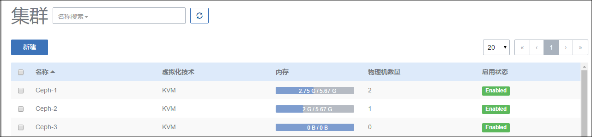

# 9.1 集群介绍

在第一章概述中，我们已经介绍了各种术语的概念，由于集群是一个新引入的概念，有必要先介绍一下几种主要资源之间的依赖关系。集群与主存储、网络之间存在着挂载卸载的关系，其结构如图9-1-1所示。

###### 图9-1-1  集群结构图

- 一个集群可以挂载一个或者多个主存储, 一个主存储也可以加载多个集群。只要这些主存储可以被这个集群中的所有主机访问. 同时, 主存储也
可以从集群卸载。主存储与集群的依赖关系如图9-1-2所示.

###### 图9-1-2 集群结构图

- 只要集群中的主机都在所挂载的L2网络所代表的物理二层广播域中,一个集群可以挂载一个或多个L2网络。一个网卡只能创建一个L2网络，同一类型的多块网卡可以用统一的网卡名创建多个L2网络，但只能挂载到不同的集群。

- 集群本身与镜像服务器没有直接关系，一个Zone可以加载多个镜像服务器，所以一个镜像服务器可以为多个集群提供服务。需要注意的是主存储和镜像服务器（备份存储）具有相关性。

> 例如Ceph主存储只能与Ceph镜像服务器一同工作，如果用户只添加了本地镜像仓库与Ceph主存储，云主机也是不能创建成功的。主存储（PS）和镜像服务器（BS）的相关性关系如图9-1-3所示

###### 图9-1-3 主存储与备份存储关系图
