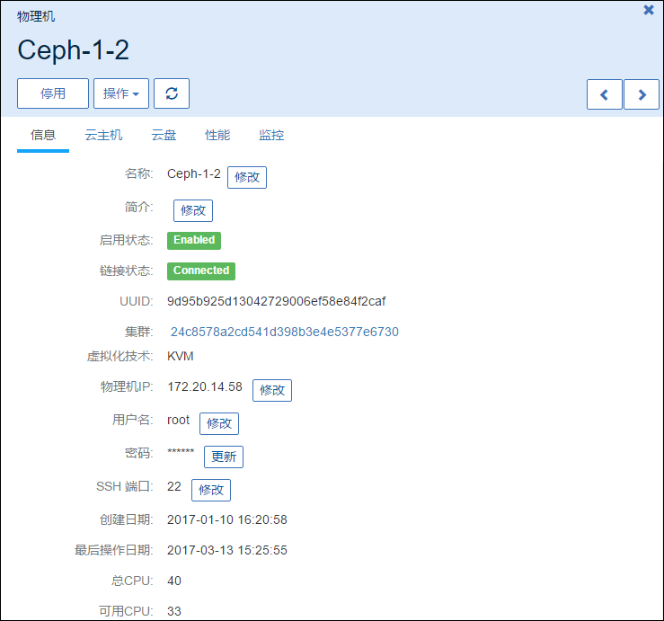
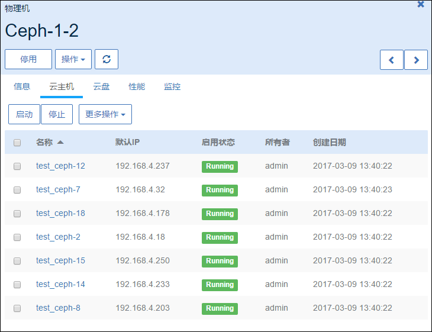
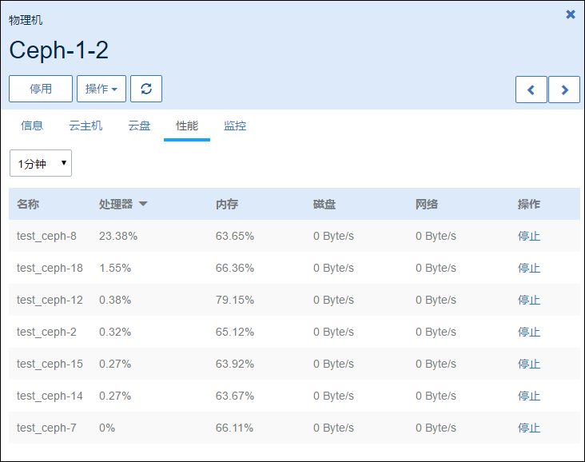

# 8.1 单物理机操作

在物理机列表界面，点击相应的物理机名字，可以展开物理机的详细信息并对物理机进行相应的操作，如图8-1-1示。

可支持启用、停用、重连、进入维护模式、修改密码、删除、修改用户名、修改SSH端口、检查日志等操作。在物理机详情里，可以修改物理机的名字，简介以及物理机的IP地址等。点击右上角的关闭按钮可以关闭窗口。

###### 图8-1-1  物理机单机操作

单台物理机支持的具体操作定义如下：

1.重连：如果更新了物理机的内存或者硬盘，可以使用物理机的重连操作更新ZStack的数据库。

2.进入维护模式：确认物理机进入维护模式后，ZStack会主动停止该物理机上所有正在运行的云主机

* 物理机进入维护模式后，若主存储为共享存储，则ZStack会自动迁移其上的云主机
* 若主存储为本地存储，则ZStack会停止其上的物理机。

3.修改IP：修改物理机的IP地址，如果物理机的IP地址发生了变化，可以点击物理机详情页的信息下的物理机IP修改按钮进行修改。IP地址修改后，系统会重连物理机。

4.修改密码：如果物理机的密码变更了，可以点击修改密码进行物理机密码的更改。

5.删除物理机：删除物理机的操作需要首先将此物理机进入维护模式才可操作，否则无法直接删除物理机。

> 如果主存储为本地存储，删除物理机后，会自动删除该物理机上的云主机和数据云盘。如果并非采用立即删除策略，删除物理机后，此物理机的对应云资源需手动删除。如果采用立即删除策略，删除物理机后，此物理机的对应资源需会自动删除。由于删除物理机而导致云主机状态变为Destroyed的情况，将无法恢复。即使重新添加此物理机，ZStack也将重新部署此物理机，之前的数据库资源将无法恢复。
>
> 如果采用了共享存储作为主存储，且资源允许，相应的云主机会自动迁移至其他可用的物理机上，不会影响数据安全性；如果资源不足，则相应的云主机会停止。此时可能会有部分云主机因其他物理机满足资源条件已迁移，也有部分云主机因资源不足而停止。

6.修改用户名：修改物理机的用户名，注意：此操作要求待修改的用户名拥有sudo权限，而且修改完毕用户名，请同时修改此用户名的密码。否则物理机可能重连失败。

7.修改SSH端口：修改物理机SSH登录的端口号。修改此端口号时，请确保此端口号已生效，且物理机的防火墙对端口也允许访问。

8.修改名字、简介等操作：支持对物理机的名字、简介进行修改。

9.操作云主机、云盘：

在物理机详情界面还可以显示在该物理机上的云主机和数据云盘。如图8-1-2所示。

###### 图8-1-2  物理机的云主机信息界面

10.云主机性能监控：

在物理机性能界面可以看到此物理机上各云主机使用资源的实时情况。如图8-1-3所示。针对异常负载的云主机可以在此界面点击停止将其关机。

###### 图8-1-3 云主机资源实时情况界面

