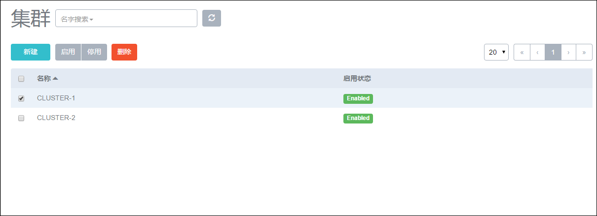

# 9 镜像管理

点击菜单栏的镜像按钮，进入镜像管理界面，如图9-1所示。在镜像管理界面，可以查看镜像列表信息，并对镜像进行添加、启用、停用、删除、彻底删除、恢复和更改所有者等操作。在镜像详情页可以修改镜像的名字、简介、镜像平台及镜像类型

添加镜像的详细步骤参考初始化时添加云主机镜像的相关步骤。

镜像列表分为两栏，一栏为可用，代表目前未被删除的镜像。一栏为已删除，代表目前已被删除但尚未彻底删除的镜像。

镜像资源的搜索目前支持名字、UUID和所有者进行搜索。

###### 图9-1  镜像管理界面

