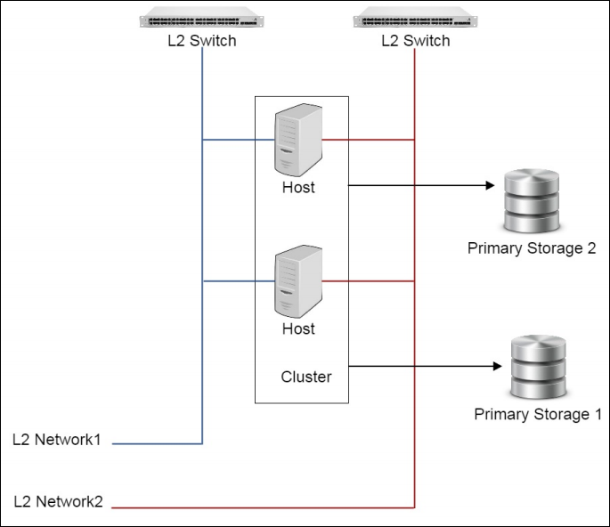

# 9.1 单镜像操作

在镜像列表界面，点击相应的镜像名字，可以展开镜像的详细信息并对镜像进行相应的操作，如图9-1-1所示。可支持添加、启用、停用、删除、恢复、彻底删除、更改所有者等操作。

在镜像详情界面里，还可以修改镜像的名字、简介、镜像平台及镜像类型等。镜像详情界面里的容量代表了此云盘占用的虚拟空间大小，实际容量代表了此云盘在物理机上占用的实际空间大小。

点击右上角的关闭按钮可以关闭详情窗口。还可以复制镜像路径，对镜像进行拷贝定制操作。

###### 图9-1-1  镜像详细信息界面

Mevoco会根据镜像平台的类型，给云主机使用不同的设备。例如Linux和WindowsVirtio平台将会使用快速的Virtio设备，Windows平台将会使用QEMU 模拟的普通硬盘和Intel Pro/MT 1000网卡设备。如果镜像平台在添加时指定错误，可以在镜像详情界面进行修改 。

在用户管理中，支持对镜像资源的共享与召回，具体请参考17.3资源共享与召回。Admin账户还可以在操作栏的下拉菜单选择更改所有者将镜像的所有者修改。

