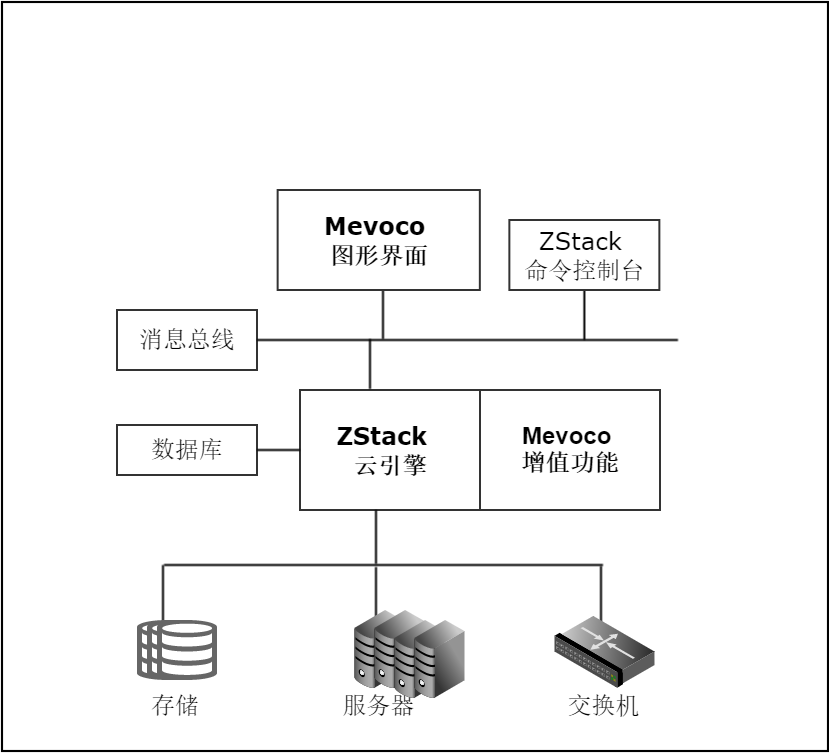

# 1.1 系统简介
旨在满足用户对IaaS(基础设施即服务)软件的需求，帮助企业快速升级到云计算，实现互联网+的能力。

本公司基于ZStack云引擎，设计了全新的Mevoco云计算系统软件。

Mevoco云计算系统具有稳定、易用、无缝升级、性能优异等特点。用户可以在短时间内根据本手册完成私有云系统的安装和部署。

Mevoco系统（架构如图1-1所示）由ZStack云引擎、Mevoco图形界面、Mevoco增值功能、ZStack命令控制台组成。辅以系统数据库和消息总线，便可以管理和分配数据中心的海量存储、服务器、网络连接能力等资源。

###### 图1-1  Mevoco系统架构图

Mevoco产品在类似的IaaS软件产品中有一系列独特的创新，包括全异步架构、进程内微服务架构和一致性哈希高可靠环等。通过先进的架构设计，本产品可承载数据中心对云计算平台超高的并发API请求（单一管理节点可以快速响应每秒钟数万条API请求），具备稳定安全的运行能力。同时Mevoco的架构极大的降低了数据中心对云平台在部署、运维方面的需求（普通的网络管理员便可以轻松搭建和配置云平台）。

通过一键安装功能，用户可以在一个指定操作系统的物理机上完成全自动的产品安装。安装完成后，用户可以通过任意浏览器就可以打开Mevoco的图形界面接口。在首次登录界面后，Mevoco会引导用户进行初始化配置。

经过短短7步配置后，用户就可以在Mevoco系统里创建KVM云主机。Mevoco将根据用户的配置，给云主机自动的分配IP地址。用户可以添加安全组规则来制定云主机的防火墙策略。针对网络隔离的环境，用户也可以设置弹性IP地址，进行公有网络IP地址与私有网络IP地址的动态绑定。

在Mevoco环境里，用户可以快速的创建、浏览、监控、操作云主机和云盘等云计算的基础资源。用户访问云主机的方式可以通过Mevoco界面集成的控制台，或者通过云主机的IP地址。用户可以通过云主机安装程序，快速的保存云主机镜像模板。如果不慎误删除了云主机、云盘或者镜像资源，Mevoco的延时删除策略也可以帮助用户快速的恢复误操作。

当运行系统内云主机实际消耗资源比申请的资源小时，Mevoco系统管理员可以通过调整CPU、主存储和内存的超分比例来提高当前云系统的资源利用率。同时Mevoco也设计了主存储资源阈值来监控用户实际资源占用率。

当用户需要嵌套虚拟化的支持时，可以设置CPU的工作模式，让物理机的CPU特性传递给嵌套的云主机监控器，用户在生产环境中可轻松部署嵌套虚拟化。

针对私有云集群和云主机的高可用HA需求，Mevoco可实现两台管理节点处于双工模式，将Mevoco提供的各种服务设置为高可用模式。任一管理节点处于异常断电、断网、关机等情况，另一管理节点可迅速恢复。

Mevoco的多租户管理，可提供不同账户和用户对系统资源的访问控制，可实现细粒度的资源归属及权限控制的划分。配合计费功能，以资源的规格和时间作为基本计费单位，并以时长作为服务使用记录，可实现对不同账户使用的业务量进行统计计费。

Mevoco的弹性IP地址，可实现公有网络和私有网络在隔离网络环境之间的通信连接，也可动态绑定和解绑定弹性IP地址，实现弹性IP地址的动态切换和扩展。

Mevoco的性能监控和告警机制，可对私有云内部的各种资源进行实时监控其状态和性能。异常负载或异常状态均可快速定位，方便用户分析及控制私有云的稳定性。

Mevoco的镜像仓库，支持在线的云主机创建镜像。可以高效的管理虚拟机镜像的版本变迁以及发布，实现快速上传、下载镜像，镜像快照，以及导出镜像的操作。

使用Mevoco云平台管理软件可以降低数据中心运维成本，提高数据中心运维效率，帮助用户快速进入云管理阶段。

