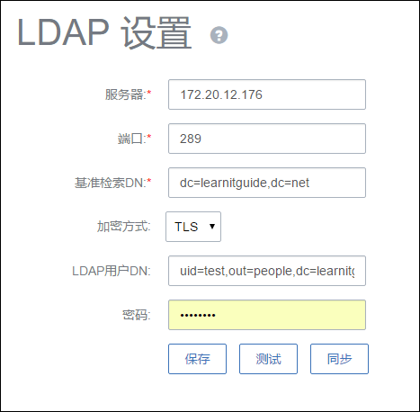
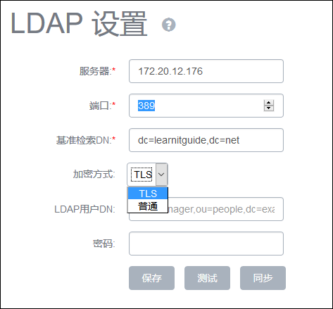

# 操作助手
这是自Mevoco1.6版本起，新增的智能提示功能。当用户进行一个操作时，如果缺少必要的条件，那么会在UI的左下角弹出一个窗口，提示用户缺少某个条件，并可以直接通过此按钮添加该条件。

例如在创建虚拟机时，用在此之前删除了所有的主存储，那么它作为新建虚拟机的一个必要条件，该窗口会自动弹出如图6-4-1所示：

###### 图6-4-1 新建云主机页面
点击添加按钮，在本页面会出现添加主存储的窗口，如图6-4-2所示，创建完成后提示窗口会自动消失。

###### 图6-4-2 添加主存储

以下场景中也会触发弹出此窗口。

1. 所有的集群都不存在时，进行创建物理机，创建虚拟机，网络加载集群，主存储加载集群的操作

2. 所有的物理机都不存在时，进行创建虚拟机，添加网络的操作

3. 所有的网络都不存在时，进行集群加载网络，创建虚拟机，启动虚拟机的操作

4. 所有的主存储都不存在时，进行创建虚拟机，创建云盘，集群加载主存储的操作

5. 所有的镜像服务器都不存在时，进行创建虚拟机，添加镜像的操作

6. 在删除所有计算规格后，进行创建虚拟机的操作

7. 在删除所有磁盘规格后，进行创建云盘，使用iso创建创建虚拟机的操作