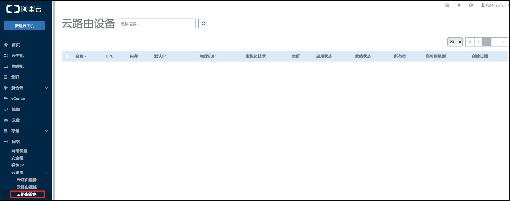

# 14.4.4 云路由设备

点击菜单栏的网络中的云路由设备按钮，进入云路由设备管理界面，如图14-4-2-1所示。

###### 图14-4-4-1 云路由设备界面

云路由设备本身是一台特殊的云主机，里面安装了多种网络服务。用户不能像控制云主机那样控制云路由设备，当用户启动使用该云路由的云主机时，云路由设备将自动被创建并开启。如图14-4-4-2所示。

###### 图14-4-4-1 自动启动云路由设备

