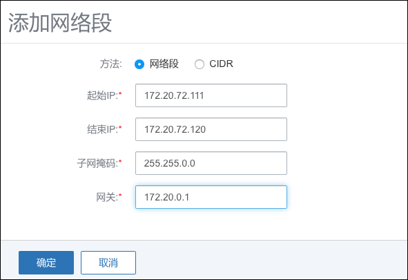
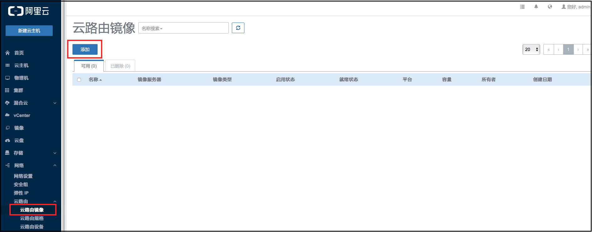
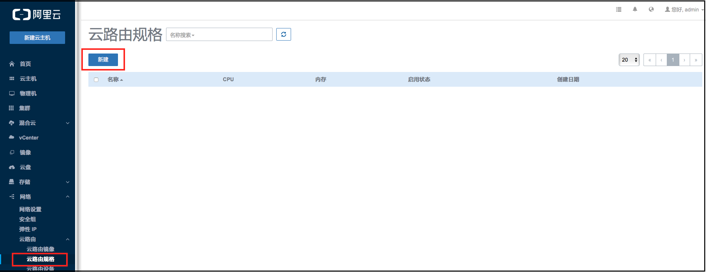

# 14.4.1 网络设置（云路由）
从Mevoco 1.0起，默认支持分布式扁平网络。Mevoco 1.8开始，通过云路由网络功能。管理员在Mevoco中配置云路由后，可以支持弹性网络、端口转发和负载均衡等网络功能。

点击菜单栏的网络按钮，进入网络管理界面，如图14-4-1-1所示。在Mevoco中，网络管理主要涉及网络本身、网络IP段、DNS的添加和删除，及网络资源的共享和召回，同时可以显示DHCP Server所占用的IP地址。

在云路由网络中，添加网络与上文中有所不同。可以分为添加公有网络、添加云路由镜像、添加云路由规格、添加私有网络四个部分。

1. 创建公有网络
 * 公有网络一般与管理网络使用同一网络，为物理服务器配置IP地址。点击菜单栏的网络进入网络设置界面。如图14-4-1-1所示。

###### 图14-4-1-1 网络设置界面

点击添加按钮，在弹出的添加网络中输入如下信息。如图14-4-1-1所示。需要填入：名字，类型，网卡、网络服务、网络段、DNS信息。

###### 图14-4-1-2 添加无服务网络界面

名字： 公有网络

类型： L2NoVlanNetwork

网卡： eth0

网络服务：无服务网络

网络段和DNS根据实际情况填写可以连接公网的网络段和DNS。

###### 图14-4-1-3 添加网络段

 

###### 图14-4-1-4 添加DNS

网络新建后，会弹出挂载集群的窗口，请选择一个可以用的集群挂载。

 
###### 图14-4-1-5 加载网络到集群

挂载完成后，公有网络就创建成功了。公有网络不为云主机提供网络服务（即云主机不会分配到该网络段的IP）。

* 添加云路由镜像

选择主菜单中网络的云路由镜像，进入云路由镜像界面。如图14-4-1-6所示。
 

###### 图14-4-1-6 云路由镜像界面

点击添加按钮，进入添加云路由镜像界面。这里与添加普通镜像十分类似。输入名字、URL并选择镜像服务器。

**注意：**在官方给出的离线环境中，已经封装了最新的云路由镜像，URL使用`file:////opt/zstack-dvd/zstack-vyos-virtualrouter.qcow2`即可。也可以去官网上获取云路由镜像链接。

 

###### 图14-4-1-7 添加云路由镜像

* 添加云路由规格

 

###### 图14-4-1-8 云路由规格界面

其中，【公共网络】的【地址】是物理服务器配置的IP地址，【公共网络】的【网关】是环境网络设备；【公共网络】的【保留可用范围】是云路由使用的范围，用于云主机出口地址；【内部接入网络】是虚拟地址，属于Mevoco管控的网络。