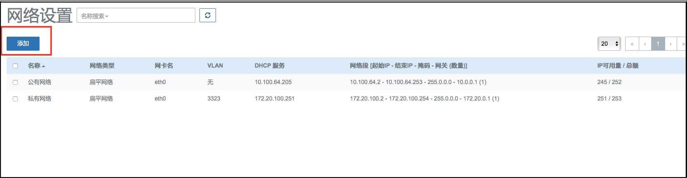

# 14.4.1 网络设置（云路由）
从Mevoco 1.0起，默认支持分布式扁平网络。Mevoco 1.8开始，通过云路由网络功能。管理员在Mevoco中配置云路由后，可以支持弹性网络、端口转发和负载均衡等网络功能。

点击菜单栏的网络按钮，进入网络管理界面，如图14-4-1-1所示。在Mevoco中，网络管理主要涉及网络本身、网络IP段、DNS的添加和删除，及网络资源的共享和召回，同时可以显示DHCP Server所占用的IP地址。

在云路由网络中，添加网络与上文中有所不同。可以分为添加公有网络、添加云路由镜像、添加云路由规格、添加私有网络四个部分。

1. 添加网络
 * 公有网络一般与管理网络使用同一网络，为物理服务器配置IP地址。点击菜单栏的网络进入网络设置界面。点击添加按钮，在弹出的添加网络中输入如下信息。如图14-4-1-1所示。

###### 图14-4-1-1 选择EIP的内部网络

其中，【公共网络】的【地址】是物理服务器配置的IP地址，【公共网络】的【网关】是环境网络设备；【公共网络】的【保留可用范围】是云路由使用的范围，用于云主机出口地址；【内部接入网络】是虚拟地址，属于Mevoco管控的网络。