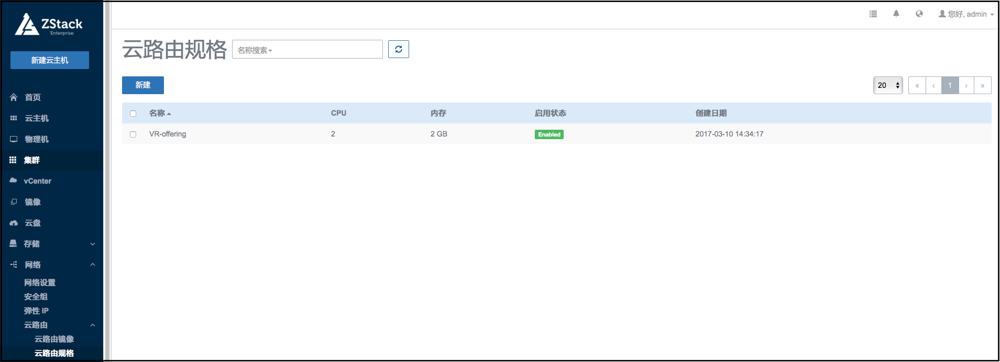
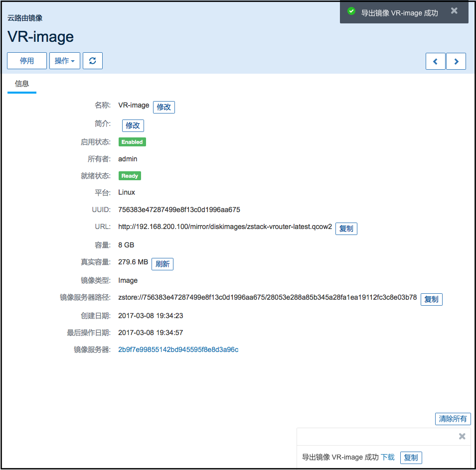
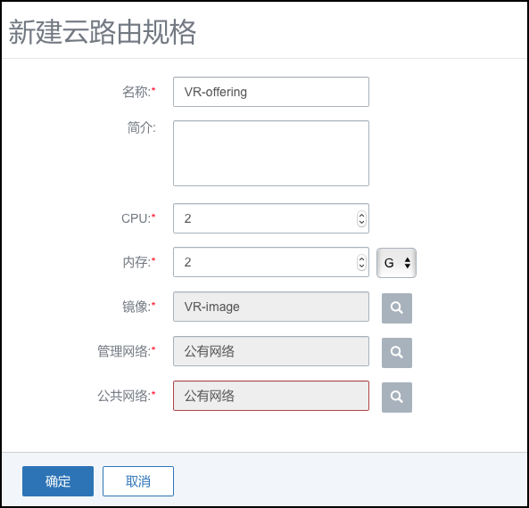

# 14.4.3 云路由规格

点击菜单栏网络中的云路由算规格，进入计算规格管理界面，如图16-1示。在计算规格管理界面，可以添加、删除计算规格，也可以进行批量操作。

###### 图14-4-3-1 云路由规格界面

###### 图14-4-3-2 云路由规格详情

在计算规格列表界面，点击添加，可以添加一个计算规格，如图16-3所示。在添加界面，需要输入如下信息：
名字：计算规格的名字。
简介：可留空不填。
CPU数：云主机CPU的核数。
内存：云主机内存的大小。
镜像：云路由的镜像，请从[官网](/www.mevoco.com)下载。
管理网络和公共网络：这里只可选的为无服务网络。

注意：用户需完全理解磁盘带宽和网络带宽配置的含义后，才能进行对应的设置，否则可能会导致无法从云主机下载文件。
png
点击某个计算规格，可以查看这个计算规格的详情，除了停用和删除操作，只可以修改这个计算规格的名字和简介，如图16-2所示。

###### 图14-4-3-2 云路由规格详情
