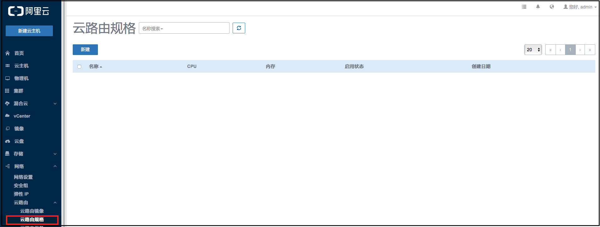

# 14.4.3 云路由规格

点击菜单栏网络中的云路由算规格，进入计算规格管理界面，如图16-1示。在计算规格管理界面，可以添加、删除计算规格，也可以进行批量操作。

###### 图14-4-3-1 云路由规格界面

点击某个计算规格，可以查看这个计算规格的详情，除了停用和删除操作，只可以修改这个计算规格的名字和简介，如图16-2所示。

###### 图14-4-3-2 云路由规格详情

在用户管理中，支持对计算规格的共享与召回，具体请参考18.3资源共享与召回。
在计算规格列表界面，点击添加，可以添加一个计算规格，如图16-3所示。在添加界面，需要输入如下信息：
名字：计算规格的名字。
简介：可留空不填。
CPU数：云主机CPU的核数。
内存：云主机内存的大小。
磁盘带宽：云主机根云盘和数据云盘的IO带宽上限。为空时，代表不限制IO带宽。带宽设置的基本单位为MB/s。
上行网络带宽：从云主机上上传的网络带宽的上限。为空时，代表不限制上行网络带宽。
下行网络带宽：从云主机上下载的网络带宽的上限。为空时，代表不限制下载网络带宽。
注意：用户需完全理解磁盘带宽和网络带宽配置的含义后，才能进行对应的设置，否则可能会导致无法从云主机下载文件。
png
