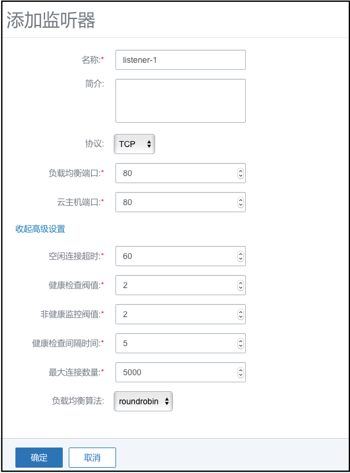

# IPsec隧道

IPsec隧道是透过对IP协议的分组进行加密和认证来保护IP协议的网络传输数据。

Mevoco支持采用IPsec隧道技术实现站点到站点（site-to-site）的虚拟私有网络（VPN）连接。

**注意：**

* IPsec连接模式，基于安全考虑，只支持主动模式（Main Mode），不支持积极模式（Aggressive Mode）；仅支持ESP封装协议；

* IPsec传输模式，只支持站点到站点的隧道模式，不支持PC点对点模式（基于云端网络模型考虑），不支持两端存在NAT网络；

* IPsec路由模型，只支持基于对端网段配对模型，只支持路由配对模式，不支持路由转发模式（不支持OSPF或BGP等动态路由协议）


为了更好的演示IPsec功能，我们准备了**两个mevoco环境**，其网络情况如下：
```
Mevoco1
公网1:172.20.72.111-120
私网1:10.0.0.0/24
IPsec-test-VM1:10.0.0.223
```
```
Mevoco2
公网2:172.20.72.181-190
私网2:192.168.0.0/24
IPsec-test-VM2:192.168.0.252
```
我们之间进入VM1的console，去ping VM2的IP，是肯定ping不通的。此时我们借助IPsec来联通两个私有网段。

点击Mevoco1菜单栏的网络中的IPsec隧道按钮，进入IPsec隧道界面，如图14-4-7-1所示。


###### 图14-4-7-1 IPsec隧道界面 

点击新建按钮，弹出新建IPsec界面，如图14-4-7-2所示。需要填写名字、简介、公共网络及IP、本地子网、远端地址、远端子网、认证密钥。


###### 图14-4-7-2 新建IPsec隧道1

名字：IPsec隧道名称。

公共网络：选择一个可用的公有网络1（参考[14.4.1](/Network/VR-network.md)），该网络与Mevoco2的公有网络2必须可以通信。

公共网络IP：指定一个个公有网络段中的IP。

本地子网：选择一个可用的私有网络1（参考[14.4.1](/Network/VR-network.md)）。

远端地址：Mevoco2中的公共网络IP。我们这里从公网2中选择一个172.20.72.181,在配置Mevoco2的公共网络IP也设置为此IP.

远端子网：远端的一个私有网络段，这里为192.168.0.0/24。

认证密码：两边通信的校验密码。支持所有长度的任意字符串。

创建mevoco1的IPsec后，打开Mevoco2的新建IPsec页面。如图14-4-7-3所示。



###### 图14-4-7-3 新建IPsec隧道2


基本信息
创建IPsec隧道时，需要填写必要的本端和远端网络信息，包括：本端公共网络、本端子网、远端地址、远端子网和认证密钥等信息。在两个Mevoco站点场景下，填写以上基本信息则可建立IPsec隧道（高级设置内容一致）。

高级设置
创建IPsec隧道时，根据对端的网络设备IPsec配置内容需调整以下的参数，包括：IKE验证算法、IKE加密算法、IKE完整向前保密、ESP认证算法、ESP加密算法和完全正向保密（PFS）等参数。管理员需根据对端的网络设备，调整高级设置的内容。

