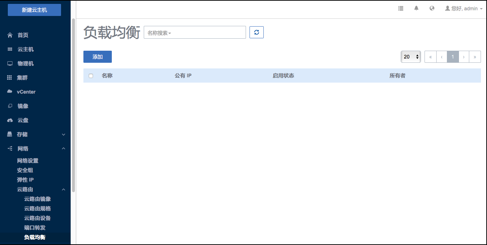

# 负载均衡

负载均衡器可以将公网地址的访问流量分发到一组后端的云主机上， 并支持自动检测并隔离不可用的主机，从而提高业务的服务能力和可用性。 

可以根据实际情况，随时添加或删减负载均衡规则中的云主机来调整服务能力，而且这些操作不会影响业务的正常访问。 负载均衡器支持HTTP/TCP 两种协议。此外，负载均衡器还支持灵活配置多种转发策略，实现高级转发控制功能。

### 添加负载均衡

点击菜单栏中的负载均衡按钮，进入负载均衡管理页面。如图14-4-7-1所示，用户可以在此界面查看负载均衡状态。

###### 图14-4-7-1  负载均衡

点击添加按钮，弹出添加负载均衡窗口。填写名称、外部网络、负载均衡端口、云主机端口，点击确定添加完成

###### 图14-4-7-2  添加负载均衡

点击菜单栏的物理机按钮，进入物理机管理界面，如图8-1示。在物理机管理界面，可以查看物理机列表信息，并对物理机进行添加、启用、停用、重连、进入维护模式、删除等操作。

### 负载均衡算法：

**roundrobin:** 通过"轮询"调度算法将外部请求按顺序轮流分配到负载均衡规则指定的云主机中，它均等地对待每一台云主机，而不管其上实际的连接数和系统负载。

**leastConn：**调度器通过"最少连接"调度算法动态地将网络请求调度到已建立的链接数最少的云主机上。 如果集群中的服务器（云主机）具有相近的系统性能，采用"最小连接"调度算法可以较好地均衡负载。

**Source：**“源地址哈希”算法根据请求的源IP地址，作为散列键（Hash Key）从静态分配的散列表找出对应的服务器，若该服务器是可用的且未超载，将请求发送到该服务器，否则返回空。