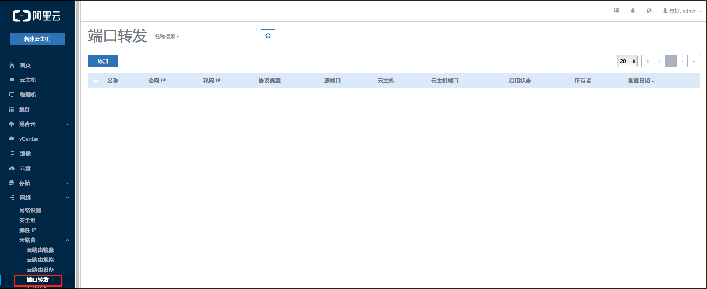
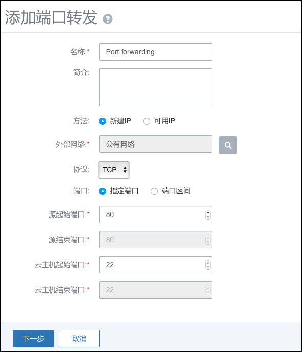
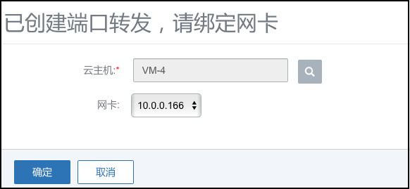
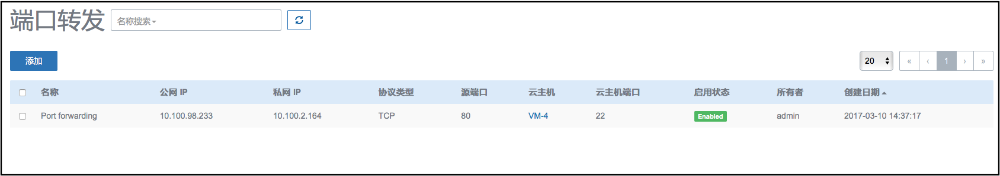
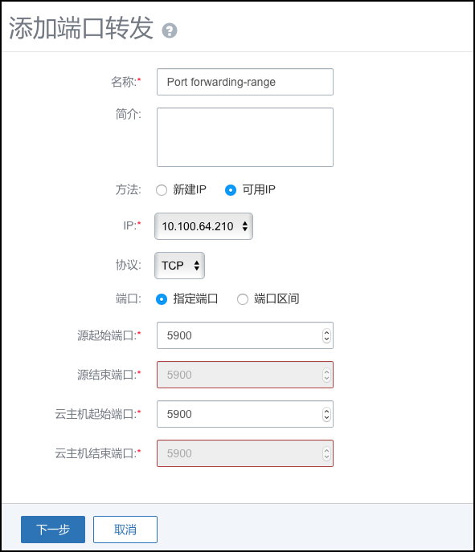

# 14.4.5 端口转发

端口转发服务，是基于云路由提供的三层转发服务，可提供将指定公共网络的IP地址端口流量转发到云主机对应协议的端口。在公共网络地址紧缺情况下，通过端口转发可以提供多个云主机对外服务，以节省公共网络地址。

点击菜单栏的网络中的端口转发按钮，进入端口转发界面，如图14-4-5-1所示。

###### 图14-4-5-1 端口转发界面

端口转发可以将一个公网节点的网络端口转发到一个私网节点的网络端口。让用户从外部经过云路由访问一个私有网络IP的端口上（访问云主机的某个端口）。

**注意：**请确认云主机内部防火墙策略，指定端口需要开放，该功能才能正常使用。

点击添加端口转发按钮，如图14-4-5-2所示。填写名字、简介、外部网络、协议、端口、外网IP起止端口、云主机IP起止端口。

###### 图14-4-5-2 添加端口转发界面

公共网络

在创建端口转发规则时，可使用新的公共网络地址，亦可使用已有规则中的公共网络地址（使用不同端口）。选择【新建IP】则分配新的公网地址，选择【可用IP】则使用已有的公共网络地址。

支持协议类型

目前端口转发服务支持TCP和UDP协议的端口，从1到65535；

端口区间

Mevoco支持端口转发方式有两类：指定端口映射和端口区间范围映射。前者是指定IP映射，后者是区间范围的IP地址一一对应。选择【指定端口】，管理员填写起始端口后，结束端口与之一致；选择【端口区间】，管理员填写源起始端口和源结束端口，则自动生成云主机起始和结束端口；

###### 图14-4-5-3 端口转发界面

###### 图14-4-5-4 端口转发界面

###### 图14-4-5-5 端口转发界面