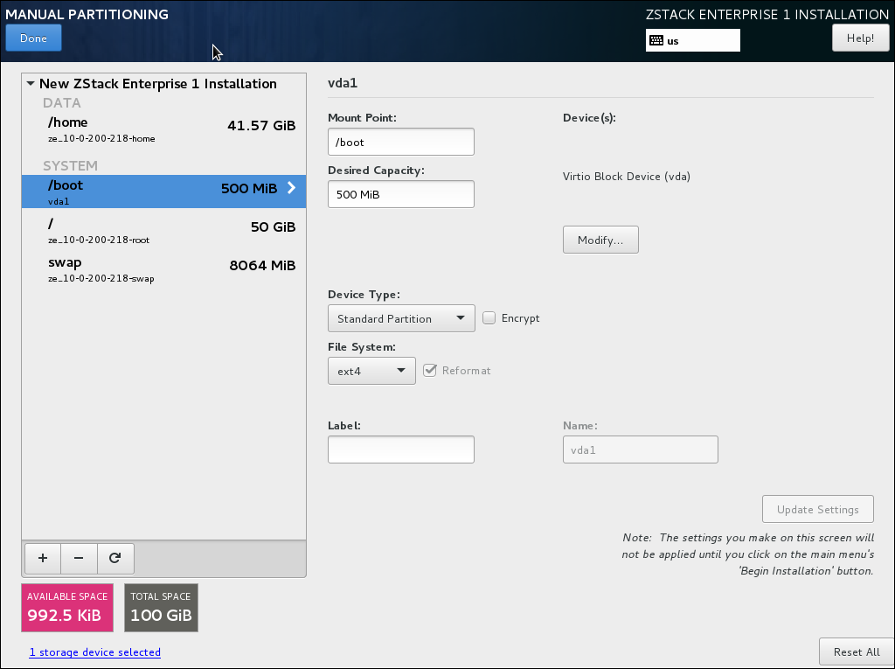
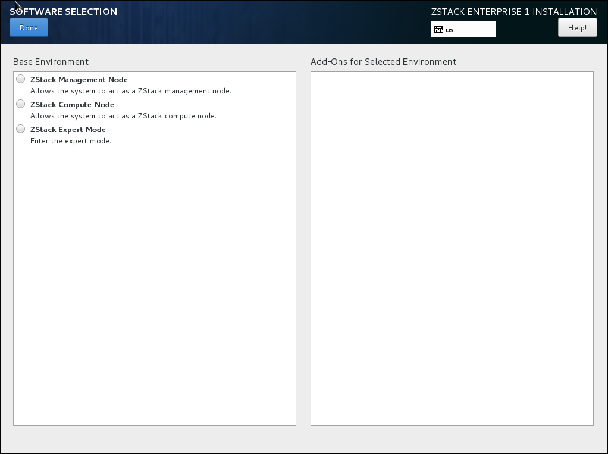

# 2.4 ZStack定制版CentOS 7.2安装

基于CentOS-7-x86_64-minimal-1511.ISO官方ISO，ZStack社区深度定制了CentOS 7.2 ISO，方便用户安装使用。

支持以下特性：

1. 基于CentOS-7-x86_64-Minimal-1511.ISO深度定制；

2. 包含Mevoco需要的所有安装包，安装Mevoco时，无须连接外网，也无须配置yum源，就可以实现Mevoco的完全离线安装；

3. 保留了CentOS7.2的官方yum源，支持官方yum更新；

4. 默认设置了root密码为password，支持安装OS后修改密码；

5. 网卡名称默认为ethx格式，例如eth0或eth1；

6. 默认选项：时区--亚洲东八区，语言--English，键盘--English(United States)。

具体步骤如下：

1.下载ZStack定制版CentOS7.2 ISO
文件名称：ZStack-Community-x86_64-DVD-1.4.0.iso (1.7G) 

MD5校验码：7bb842a260de4dd7eab1cfe10cbf9558 

下载地址1：

http://download.zstack.org/ISO/ZStack-Community-x86_64-DVD-1.4.0.iso

下载地址2：

http://pan.baidu.com/s/1boXRJxP

2.使用UltraISO（可点击此链接下载试用版），将此ISO刻录到U盘，打开UltraISO后，点击“文件”按钮，打开此ISO，如图2-4-1所示。

###### 图2-4-1 UltraISO打开ISO 
  
3.点击“启动”按钮，选择“写入硬盘镜像”，如图2-4-2所示。

###### 图2-4-2 选择写入硬盘镜像
 

4.在硬盘驱动器列表选择相应的U盘进行刻录，如果系统只插了一个U盘，则默认以此U盘进行刻录和写入，在刻录前，注意备份U盘之前的内容。

其他选项，按照默认设置，无须额外配置。点击“写入”按钮，如图2-4-3所示。

###### 图2-4-3 点击写入按钮

5.点击“是”按钮进行确认，如图2-4-4所示，UltraISO将会把此ISO刻录到U盘。

###### 图2-4-4 点击是按钮进行确认

6.刻录成功的界面如图2-4-5所示，表示ZStack的定制版CentOS 7.2 可引导U盘已刻录成功。

 
###### 图2-4-5 刻录成功界面

7.使用U盘引导安装CentOS7.2 ，在BIOS启动界面，选择使用此U盘引导安装CentOS 7.2，引导安装界面如图2-4-6所示：

 
###### 图2-4-6 ISO引导安装界面

8.安装过程中，只需进行分区，即可一键安装CentOS7.2操作系统，如图2-4-7所示的分区为根分区48G，swap分区为2G。也可根据存储及需求，提前设置好大容量分区。如果选择使用UEFI引导，分区需另设置/boot/efi。

 
###### 图2-4-7 安装分区界面

9.分区完毕后，点击“Begin Installation”按钮，如图2-4-8所示，开始安装。所有的安装包安装完毕后，点击“重启”按钮，即可启动进入CentOS7.2系统。

 
###### 图2-4-8 点击“Begin Installation”按钮

