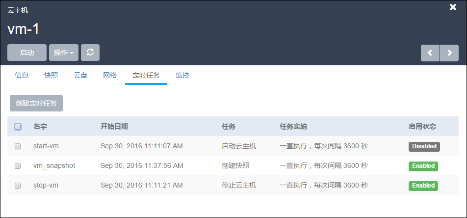
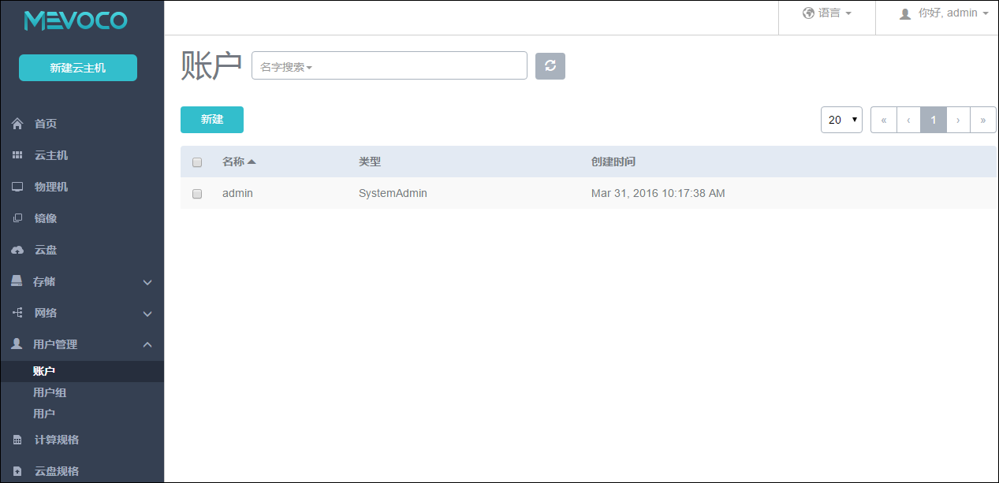
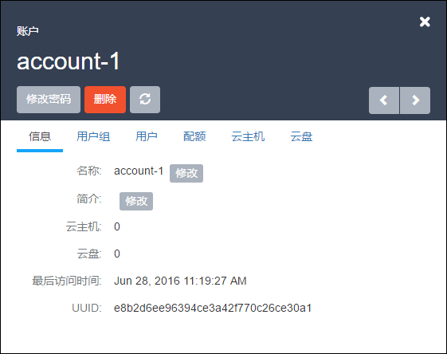

# 18.1 云主机定时任务

定时任务能够帮助用户完成周期性的资源操作任务，比如根据业务需要定时开关云主机、重启云主机、为云主机根云盘创建快照等。定时器可在虚拟机指定次数内重复执行，也可仅执行一次。未来还会开发更多的批量操作功能，以满足用户的不同需求。

点击云主机详情界面，选择定时任，如图18-1-1所示。

###### 图18-1-1 定时任务界面

如图18-1-2所示，勾选已创建的定时任务后，可以手动启用和停用。

**注意**：更改云主机所有者后，定时任务会自动变为Disabled状态。

已创建的定时任务可以手动启用和停用。当用户对Mevoco中的资源创建了定时任务后，如果出现突发情况需要暂时停用此任务。

此时可以停用定时任务功能，而不需要删除或修改已设定好的任务。当恢复正常任务周期，启用定时任务即可。mevoco将会从启用的时间点开始执行，若任务已过期，则不再执行。

> 例如，用户在创建了中午12：00（第一次执行）开始的根云盘快照任务，设定次数为10次，间隔时间为1小时，于下午14:30**停用**定时任务，此时已创建根云盘快照3次。
* 若用户在18:30启用定时任务，系统将继续执行剩下的3次任务，创建6次根云盘快照，到23:30结束。
* 若用户在第二天启用此定时任务，则任务过期则不再执行。

当恢复正常任务周期后，点击启用，所选定时任务就可以恢复正常使用了。

###### 图18-1-2 定时任务界面

### 创建定时任务

点击创建定时任务按钮，任务分为启动云主机、停止云主机、重启云主机、根云盘创建快照。如图18-1-3所示。

###### 图18-1-3 创建定时任务

* **名称：**

对于启动云主机、停止云主机、重启云主机这三种任务，我们需要在定时任务名称旁的输入框中输入名称。如图18-1-4所示。

###### 图18-1-4 任务名称

对于根云盘创建快照任务，我们除了要设定定时任务名称，还需要输入快照名称。如图18-1-5所示。

###### 图18-1-5 创建快照任务

* **开始时间：**

立即执行：从当前时间开始执行选定的任务

选择时间：在时间输入框中输入想要启动任务的时间，也可以点击输入框，在日历中选择时间。如图18-1-6所示。

###### 图18-1-6 设定开始时间

**\*重复次数及时间间隔：**

默认次数为1，当设置次数不为1时（大于1的整数）或者永久时，还需要设置间隔时间。间隔时间的单位包括：月、周、天、小时、分。如图18-1-7所示。

###### 图18-1-7 次数及时间间隔

