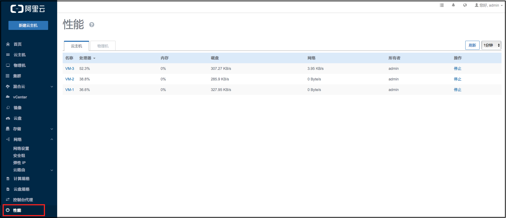

# 18.1 云主机定时任务

定时任务能够帮助用户完成周期性的资源操作任务，比如根据业务需要定时开关云主机、重启云主机、为云主机根云盘创建快照等。定时器可在虚拟机指定次数内重复执行，也可仅执行一次。未来还会开发更多的批量操作功能，以满足用户的不同需求。

点击云主机界面任务管理器按钮，进入创建定时任务界面，任务分为启动云主机、停止云主机、重启云主机、跟云盘创建快照。如图18-1-1所示。

###### 图18-1-1 定时任务界面

* 名称：

对于启动云主机、停止云主机、重启云主机这三种任务，我们需要在定时任务名称旁的输入框中输入名称。如图18-1-2所示。

###### 图18-1-2 任务名称

对于跟云盘创建快照任务，我们除了要设定定时任务名称，还需要输入快照名称。如图18-1-3所示。

###### 图18-1-3 创建快照任务

* 开始时间：

立即执行：从当前时间开始执行选定的任务

选择时间：在时间输入框中输入想要启动任务的时间，也可以点击输入框，在日历中选择时间。如图18-1-4所示。

###### 图18-1-4 设定开始时间

*重复次数及时间间隔：

默认次数为1，当设置次数不为1时（大于1的整数）或者永久时，还需要设置间隔时间。间隔时间的单位包括：月、周、天、小时、分。如图7-2-21所示。

###### 图18-1-5 创建定时任务界面

