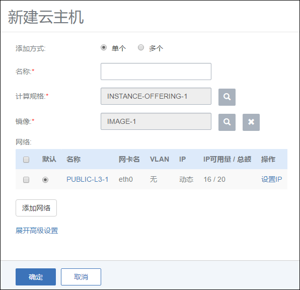
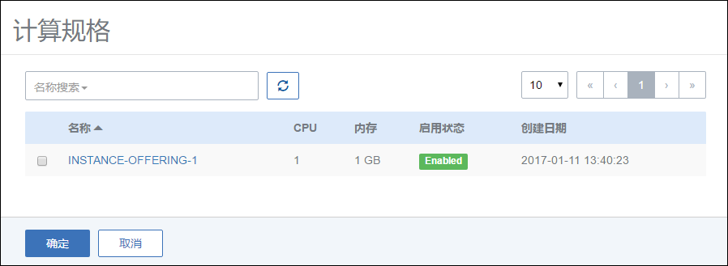
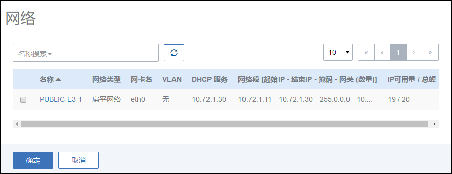
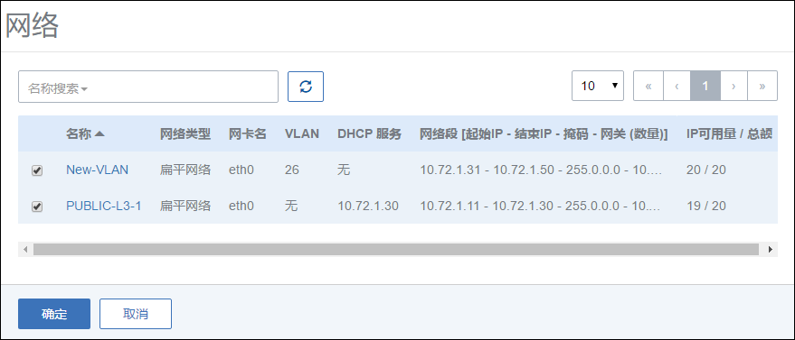
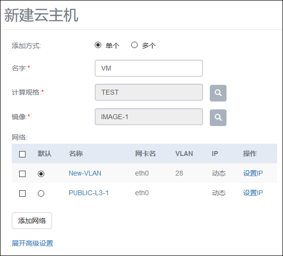
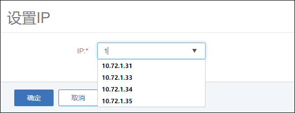

# 7.1 新建云主机

新建云主机时,如果系统各资源仅有一个,则默认会选择此资源。

新建云主机的具体步骤:

1.点击新建按钮,Mevoco系统会弹出新建云主机界面,如图7-1-1所示。

###### 图7-1-1 新建云主机界面

2.输入云主机名字。建议使用易区分之名字进行区别,例如,VM。

3.点击计算规格右侧的搜索按钮,在弹出的新界面中选择启动云主机使用的计算规格。如果规格数量较多,也可以通过搜索找到所需的规格。如图7-1-2所示。

###### 图7-1-2 选择云主机计算规格

4.点击镜像右侧的搜索按钮,在弹出的新界面中选择启动相应云主机使用的镜像模板。如图7-1-3所示。

###### 图7-1-3 选择云主机镜像

5.点击添加网络,在弹出的新界面选择可用的网络。可以选择单个网络,如图7-1-4所示。

###### 图7-1-4 选择单个网络

如果存在多个网络,也可以同时选择多个网络,如图7-1-5所示。

###### 图7-1-5 选择多网络

选择点击确定后,在新界面会可以选择多个网络时的默认网络,如图7-1-6所示。

###### 图7-1-6 选择默认网络

点击设置IP后，弹出IP输入框如图中输入需要指定的IP。如图7-1-7所示，会给出5个可用IP提示。如果可用IP数量不足5个，显示真实可用数量。

**注意：**当批量创建VM的时候，ZStack支持设置静态IP地址。当用户填写第一个IP后，批量启动的云主机的IP地址就是从第一个IP开始依次分配。

比如建立20台云主机 ip段就是用 192.168.1.1-20这20个ip

###### 图7-1-7 设置静态IP

如果用户打算快速启动云主机,可以直接点击左下角的确定按钮直接创建云主机。

创建云主机成功后,点击控制台可以访问云主机系统。

如果打算进行高级设置,可以点击展开高级设置进行配置,如图7-1-7所示。

###### 图7-1-8 高级设置界面

高级设置:

1. 添加数据云盘：创建云主机时,给云主机直接挂载数据云盘。点击数据云盘规格右侧的搜索按钮,在弹出的新界面中选择启动云主机使用的云盘。若用户使用ISO安装云主机, 在选择相应的ISO镜像后,需要指定云主机使用的根系统的云盘规格,从云盘规格的列表中进行选择。如果云盘规格列表为空,则需参考第15章云盘规格管理进行添加。

2. 选择集群：选择指定启动云主机的Host所在的cluster。点击cluster选择按钮，在弹出的新界面中选择可用集群，如果在添加集群前指定了host，只能选择这个Host所在的集群。

3. 选择主存储：指定云主机根云盘的主存储。点击主存储选择按钮，在弹出的新界面中选择可用的主存储。

**  注意：**选择主存储之前请先选定集群，指定网络与主存储必须挂载在同一集群上，云主机才能正常被创建。具体关系参考集群管理章节[9](/Cluster/README.md)

4. 选择物理机：选择指定的物理机来启动云主机。点击物理机按钮,在弹出的新界面中选择启动云主机使用的计算节点资源,如果已经选择了集群，只能选择该集群所有的物理机。可留空不填,默认为系统动态配置。

5. 高可用级别设置：选择NeverStop或None模式设置云主机的高可用特性。None代表不设置高可用;NeverStop表示云主机永不停机。

6. 控制台密码：设置控制台密码（VNC密码），长度为6-18位。

7. SSH公钥：如果预先制作了带有Cloud-init功能的镜像文件,还可输入SSH公钥,可实现创建云主机后,SSH免密码登录。详细信息请参考7.5创建云主机使用SSH公钥。

8. 输入云主机简介：可简述云主机相关信息进行备注。可留空不填。

  * 注意:若创建云主机失败,请参考[21.4](/exception/create-vm.md)创建云主机异常处理。

