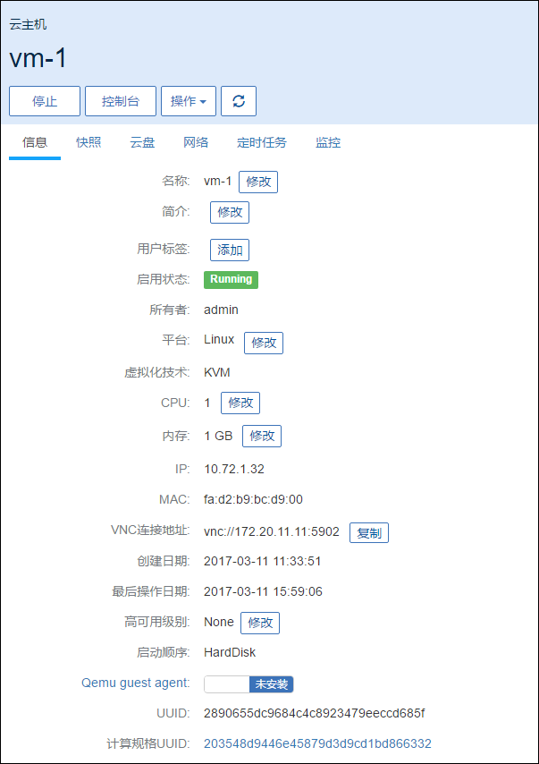
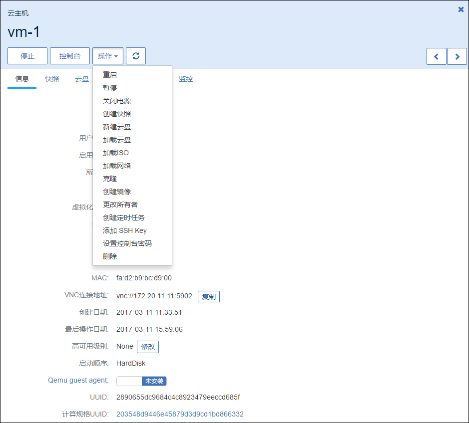
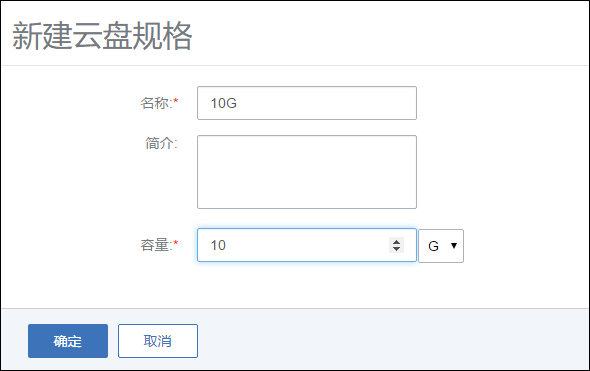
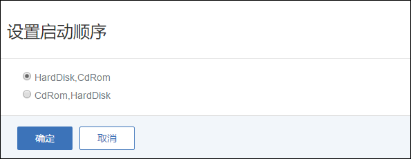
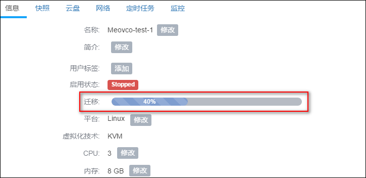

# 7.2 单个云主机操作

在云主机列表界面,点击相应云主机的行,可以展开云主机的详细信息并对云主机进行相应的操作,如图7-2-1所示。根据虚拟当前状态的不同,云主机的操作可支持启动、停止、重启、控制台、新建云盘、加载云盘、卸载云盘、加载ISO、卸载ISO、修改启动顺序、迁移、 删除、修改配置、创建镜像、创建快照、恢复快照、删除快照、加载网络、卸载网络、设置静态IP、取消静态IP设置、修改名字、修改简介、修改高可用级别、设置用户标签、指定物理机启动、更改所有者、检查日志等操作。

###### 图7-2-1 云主机详细信息界面

在相应的操作中,有如下约束条件:

1. 运行状态的云主机支持停止、重启、控制台、新建云盘、加载云盘、卸载云盘、加载ISO、卸载ISO、删除、加载网络、卸载网络、设置用户标签、设置高可用级别、更改所有者、创建快照、删除快照、查看日志等操作。对于镜像仓库类型的镜像服务器，支持创建镜像操作。

2. 停止状态的云主机支持启动、修改配置、新建云盘、加载云盘、创建镜像、加载ISO、删除、加载网络、卸载网络、设置静态IP、取消静态IP设置、设置用户标签、设置高可用级别、指定物理机启动、更改所有者、创建快照、删除快照、恢复快照、查看日志等操作。

3. 删除状态的云主机支持恢复、彻底删除和更改所有者等操作。

4. 主存储如果为本地存储,运行中的云主机不支持迁移,必须停止云主机才可进行迁移。此时的迁移主要为迁移根云盘或数据云盘。

5. 主存储如果为网络共享存储,运行中的云主机支持迁移,停止状态的云主机不支持迁移。此时的迁移为云主机在线实时迁移。主要为拷贝内存及CPU相关寄存器状态。

6. 彻底删除的操作需要将云主机首先删除作为前提。

对云主机操作的各定义如下:

1.启动:将处于停止状态的云主机启动起来,进入云主机系统;

2.停止:将处于运行状态的云主机停止掉,使云主机系统关机;

3.重启:将处于运行状态的云主机重启,使云主机系统重新启动;

4.控制台:将进入云主机系统的控制界面,可以登录控制云主机;

5.新建云盘:创建一个新的云盘并添加给云主机。具体步骤如下示:

  a) 在云主机详情页的云盘栏,点击新建云盘按钮,进入新建云盘界面,如图7-2-2所示;

  b) 输入云盘名称并选择对应的云盘规格,点击确定

注意:在系统初始化后,若系统没有添加过云盘规格,需要提前在云盘规格界面,创建新的云盘规格。详见第11章云盘管理。

###### 图7-2-2 新建云盘界面

6.加载云盘:将一个可用的未挂载云盘挂载到当前云主机。需注意:如果主存储为本地存储,那么该云盘需要和云主机在相同的物理机上。当目标云盘和云主机不在相同物理机的时,需参考第11章云盘管理的云盘详情里把云盘迁移到云主机对应的物理机上。

7.卸载云盘:将系统之前添加过的数据云盘移除掉,具体步骤如下示: 

a)点击卸载云盘按钮,进入卸载云盘界面,如图7-2-3所示; 

b)从云盘列表选择需要移除的云盘,点击确认进行移除

###### 图 7-2-3 卸载云盘界面

8.加载ISO:添加ISO镜像到云主机中,具体步骤如下示: 

  a)点击加载ISO按钮,进入加载ISO界面; 

  b)从ISO列表选择需要加载的ISO,点击确认进行加载。

9.卸载ISO:将已添加的ISO镜像从云主机中卸载,点击卸载ISO按钮,直接卸载ISO。

10.修改启动顺序:如果用户是在云主机创建之后挂载ISO(在创建云主机时,镜像选 择为ISO时,会首先从ISO启动),云主机默认的启动顺序是:第一从硬盘引导,第二从ISO 引导。

用户如需更改启动顺序,例如通过ISO启动来修复硬盘,需点击云主机详情的“启动顺序” 按钮来更改云主机的启动顺序。

如图7-2-4及7-2-5所示。其中Cdrom代表ISO引导时的虚拟光驱。需注意:如果选择CdRom是第一启动顺序,只有通过UI上点击停止和启动后,才会从CdRom启动。如果直接在云主机操作系统中通过reboot命令重启,还是会从硬盘启动。

用户在第一次创建云主机选择ISO进行安装时,无需选择启动顺序,Mevoco会自行从ISO引导。

###### 图7-2-4 点击启动顺序

###### 图7-2-5 修改启动顺序

11.迁移:将云主机迁移至其他计算节点。迁移的速度与两台主机的网络配置有关,如果网络配置较低,迁移速度可能较慢。具体步骤如下示:

  a)点击迁移按钮,进入迁移界面,如图7-2-6所示; 

  b)从计算节点列表选择需要迁移的目的机器,点击确认进行迁移。

###### 图7-2-6 云主机迁移选择物理机界面

12.删除:Mevoco支持三种云主机删除模式,可以在基础设置中修改:

  a)立刻删除:当用户删除云主机的时候,云主机相关资源会被立刻删除。

  b)延时删除(默认):当用户删除云主机的时候,云主机会被标记为Destroyed。24小时后,才会彻底删除,如图7-2-7所示。删除延时可以在基础设置中修改。

  c)永不删除:当用户删除云主机后,云主机相关资源永远不删除。

###### 图7-2-7 延时删除后云主机界面

如果在删除云主机的时候同时勾选了“同时删除云盘”,在删除云主机时将会同时删除该云主机上所有的云盘。如图7-2-8所示:

###### 图7-2-8 同时删除云盘界面

13.彻底删除云主机/恢复云主机:当选择延时删除云主机后,云主机会进入“Destroyed”的状态。用户可以通过点击该云主机,选择对应的按钮恢复删除的云主机,或者彻底删除它, 如图7-2-9所示。

  a)恢复:选择恢复的云主机,将会进入到“Stopped”的状态,用户可以通过启动按钮,启动该云主机。删除一个云主机,该云主机的IP地址将会返回IP地址池中。当再次恢复该云 主机时,这个云主机的IP地址可能与删除前不同。

  b)彻底删除:选择彻底删除后,云主机相关资源会被彻底删除掉。镜像文件,云盘也有相同的恢复和彻底删除的按钮。用户需谨慎操作。

###### 图7-2-9 彻底删除/恢复云主机界面

14.修改配置:对已停止的云主机,用户可以点击修改配置来选择其他可用的计算规格,在新弹出的界面选择需更换使用的计算规格来调整云主机使用的CPU、内存或其他资源。

15. 创建镜像：用户可以对云主机进行定制，可保存为镜像模板文件。如果用户使用镜像仓库类型的镜像服务器，对于云主机运行状态创建的镜像，可以保存云主机当时的应用场景如图7-2-10所示，点击创建镜像按钮，在新弹出的界面输入待保存的镜像名字，点击确定，程序会后台创建镜像文件。其他类型的镜像服务器需要在云主机停止后才能进行此操作。创建成功后，镜像列表会显示此镜像文件 。

###### 图7-2-10 镜像仓库创建在线虚拟机镜像界面

16.创建快照:用户可以对云主机的根云盘进行创建快照的操作。从1.4版本后,Mevoco 支持在线创建快照,即对运行中的云主机创建快照点。如图7-2-11所示,点击创建快照按钮,在新界面输入待创建快照的名称,点击确定即可对根云盘当前状态创建快照。

注意:如果云主机正在进行大量的I/O并发,此时创建快照,有可能会有数据丢失的风险,请谨慎操作。以防万一,可以在云主机停止后,再创建快照。如果用户从低版本升级到新版本,在线快照并不适用于正在运行中的云主机,需要云主机重启后才可生效。

###### 图7-2-11 快照页面

17.加载网络:用户可对云主机动态的增加网络,例如,新增一个Vlan网络到云主机。点击云主机详情页的网络栏,点击加载按钮,新界面会列出可添加的网络列表,如图7-2-12所示,在列表中选择可加载的网络,如果存在多个网络,也可批量添加。添加网络的方法可参考第12章网络管理。加载后,云主机网络列表会显示多个网络。

###### 图7-2-12 加载网络弹出的可选网络列表

18.卸载网络:用户可对云主机动态的卸载网络,例如从云主机移除一个网络。在网络栏点击待卸载的网络,点击卸载即可将网络从云主机移除,如图7-2-13所示。

###### 图7-2-13 卸载网络界面

19.修改默认网络:在多网络列表的默认列中,选择相应的网络,会弹出新界面进行确认操作,点击确定后即可更换默认网络。

20.设置静态IP:IP地址的设置可以在新建云主机前选择网络,点击设置IP按钮,进行设置静态IP地址。也可以在停止云主机后,在云主机的网络界面选择网络设置静态IP地址。 如果设置静态IP地址,需避免与现有IP地址冲突。

21.取消静态IP:针对已设置过静态IP地址的云主机,可以取消静态IP的设置。如图 7-2-14所示,在停止云主机后,在网络页面选择待取消设置的网络,点击取消静态IP按钮,在新界面点击确定,即可取消静态IP的设置。

###### 图7-2-14 取消静态 IP 界面

22.修改名字:修改云主机的名称。云主机的名称可以重复,但建议使用易区分之云主机名字。UUID为Mevoco系统中唯一确定云主机身份的标识。

23.修改简介:修改云主机的简介。

24.修改高可用级别:修改高可用级别在NeverStop或None模式。

25.设置用户标签:对云主机设置用户标签,方便用户搜索查询云主机。用户标签可以创建多个。点击用户标签右侧的“x”可对用户标签进行删除。如图7-2-15所示:

###### 图7-2-15 用户标签界面

26.指定物理机启动:针对停止状态的云主机,可以指定从特定物理机启动,此功能只适用于使用网络共享存储的主存储方式,如果主存储为本地存储,此功能只能选择根云盘所在的物理机启动。在点击启动(指定物理机),会弹出可用的物理机界面,点击确定后,会直接从选择的物理机启动。

27.更改所有者: 将云主机的所有者更改,具体参考17.4更改所有者。 

28.检查日志: 查看云主机的相关日志记录。如图7-2-16所示。

###### 图7-2-16 云主机日志界面

