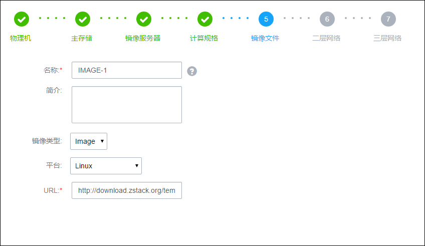
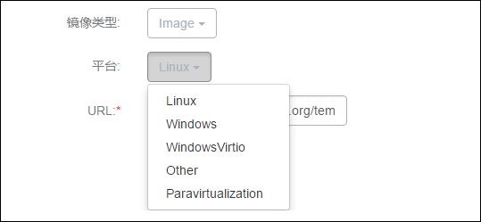

# 5.5 添加镜像

在添加计算规格后，Wizard将引导进入添加云主机镜像界面，如图5-5-1所示：
 
 
 
######图5-5-1  添加云主机镜像界面

添加云主机镜像具体步骤：

1.输入云主机镜像的名字。建议使用易区分之名字进行区别，例如，IMAGE-1。点击名字输入框后边的问号，会提示添加镜像文件的帮助。

2.输入云主机镜像的简介，可简述云主机镜像相关信息进行备注。

3.在镜像类型旁的下拉框选择相应的镜像类型，如图5-5-2所示。若指定相应的ISO以备后续安装OS使用，则选择ISO；若指定相应的image直接引导，则指定image类型。需根据镜像的文件属性选择正确的选项。
 

######图5-5-2  选择云主机镜像类型界面

4.在平台旁边的下拉框选择相应的平台类型，如图5-5-3所示。目前可支持Linux、Windows、WindowsVirtio、Other、Paravirtualization等。其中WindowsVirtio特指已经安装了硬盘和网卡的Virtio驱动的Windows镜像。
 

######图5-5-3  选择云主机镜像平台界面

5.输入相应的URL，格式为 http://或 file:///。
> 例如：http://192.168.0.10/test.qcow2 或
 file:///tmp/test-centos7.qcow2 文件
   
* 注意：file:///是三个”/”。当使用file方式上传镜像时，对应的路径应为镜像服务器的**绝对路径**，例如上例的file:///tmp/test-centos7.qcow2。在镜像服务器的/tmp目录下应存放有test-centos7.qcow2文件。

* 注意：如果镜像服务器为Ceph和fusionstor类型，目前暂不支持file:///格式的输入。

6.点击创建按钮，ZStack系统会创建下载对应的云主机镜像文件，下载过程会在后台进行。

* 注意：添加云主机镜像错误，请参考[添加云主机镜像异常处理](/exception/image.md)。

