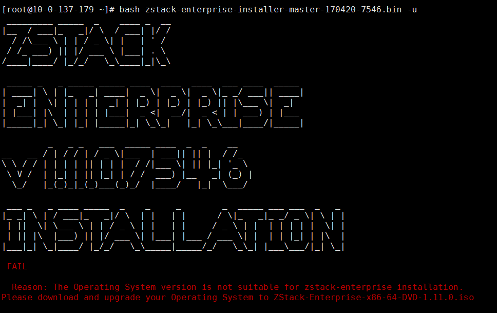
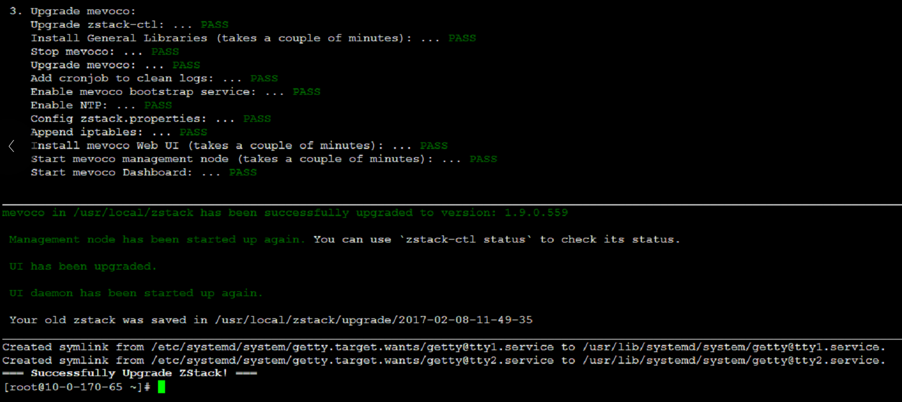
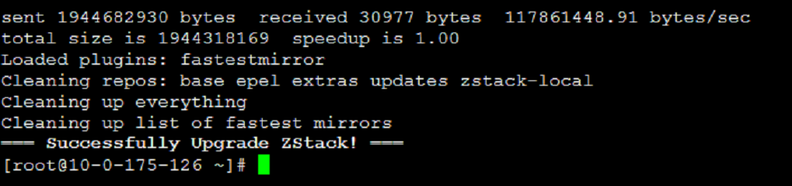

# 升级ZStack

从ZStack旧版本的环境中升级到新版本的ZStack会出现如下提示，属于正常现象。如图3-5-1所示。这是由于缺少升级新版本所必须的安装包，系统会给出这样的提示。

###### 图3-5-1 升级失败提示

在官网上下载最新版的ISO和升级脚本至/opt目录下,例如`ZStack-Enterprise-x86_64-DVD-1.9.0.iso`和`zstack-repo-upgrade.sh`。

使用命令`bash zstack-repo-upgrade.sh ZStack-Enterprise-x86_64-DVD-1.9.0.iso`

###### 图3-5-2 升级ISO环境

如果使用-r参数，表示只升级repo

###### 图3-5-3 升级成功

