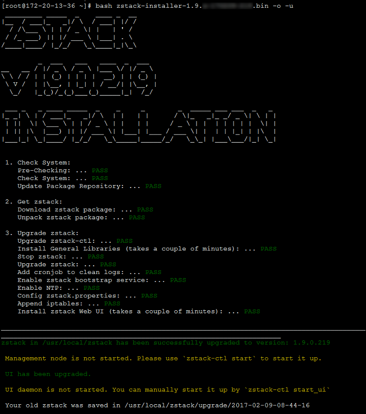

# 3.3 多节点安装

如果用户希望搭建一个高可用的产品级云环境，那么就需要部署至少两个ZStack管理节点，可能还需要单独配置高可用的MySQL和RabbitMQ及其他计算节点。

手动安装的过程请参考[多节点安装](http://zstack.org.cn/index.php?m=Page&a=index&id=12)，本节主要介绍使用ZStack脚本工具自动安装多个节点，此时MySQL和RabbitMQ默认安装在第一个管理节点中。

用户通过[3.1](/install/offline-install.md)或者[3.2](/install/online-install.md)已经安装完成一个管理节点，使用`zstack-ctl add_multi_management`命令安装。使用方法如下：

`zstack-ctl add_multi_management --host-list root:passwd1@host1_ip root:passwd2@host2_ip`

> 例如 zstack-ctl add_multi_management --host-list root:password@172.20.12.47 root:password@172.20.13.216

如图3-3-1所示,172.20.14.154为第一个管理节点，使用改命令添加172.20.12.47和172.20.13.216两个管理节点。

###### 图3-3-1 Mevoco 多管理节点安装界面
