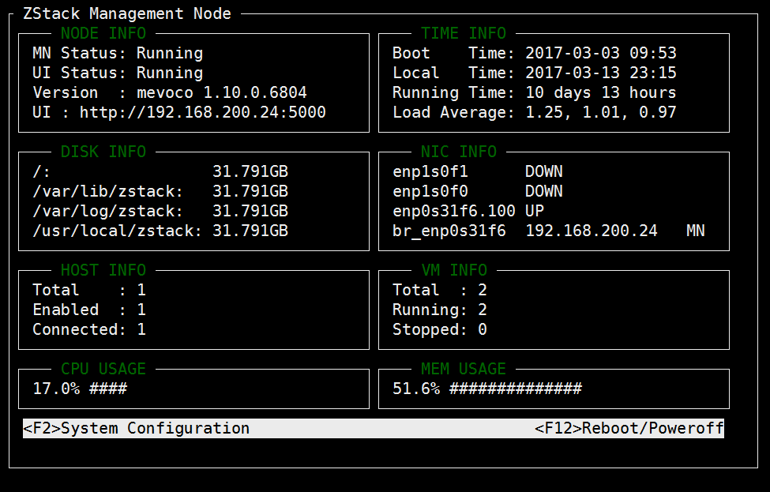
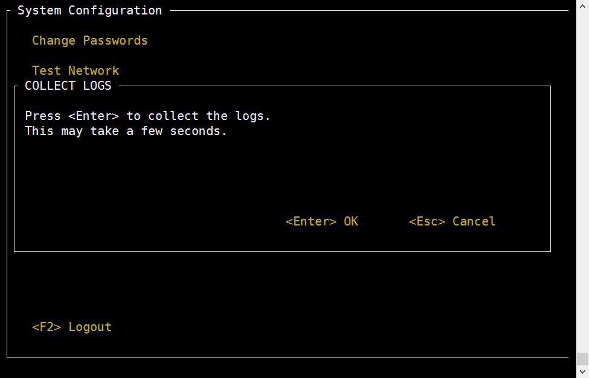
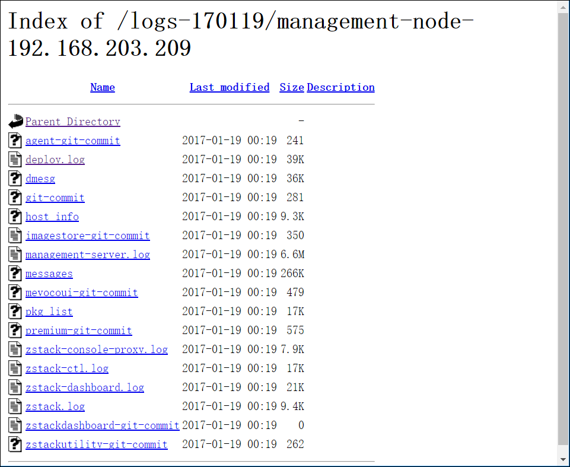
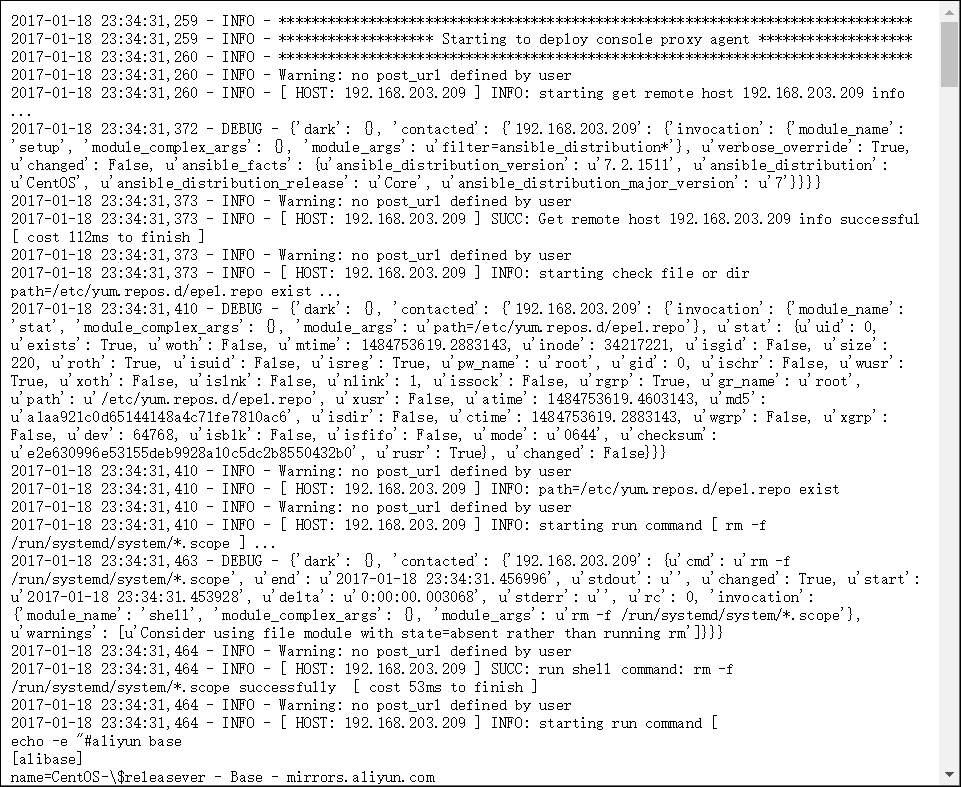
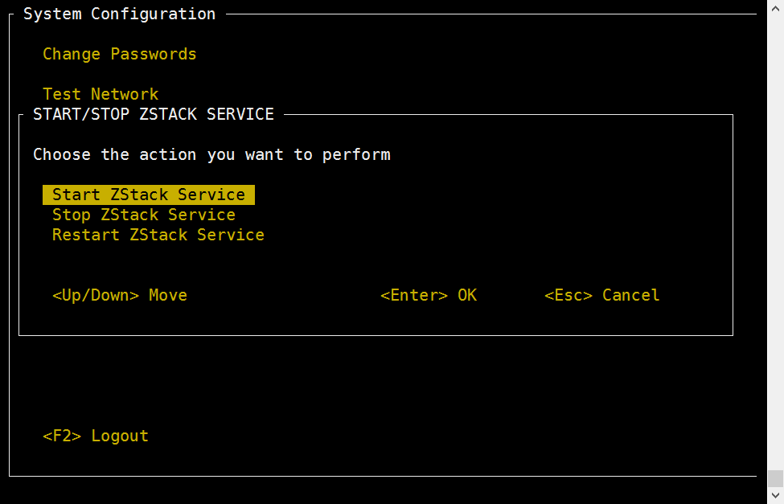
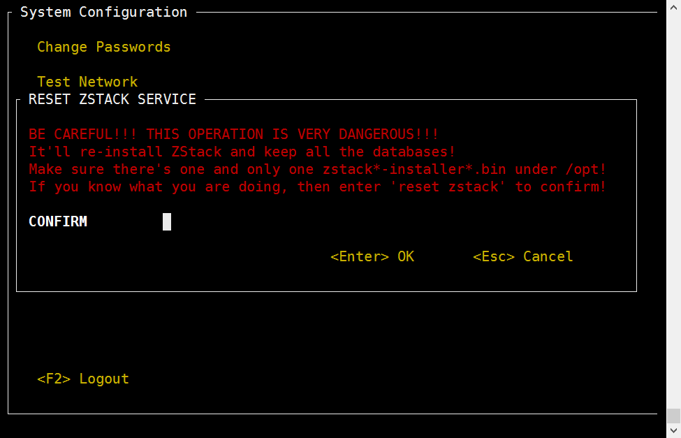
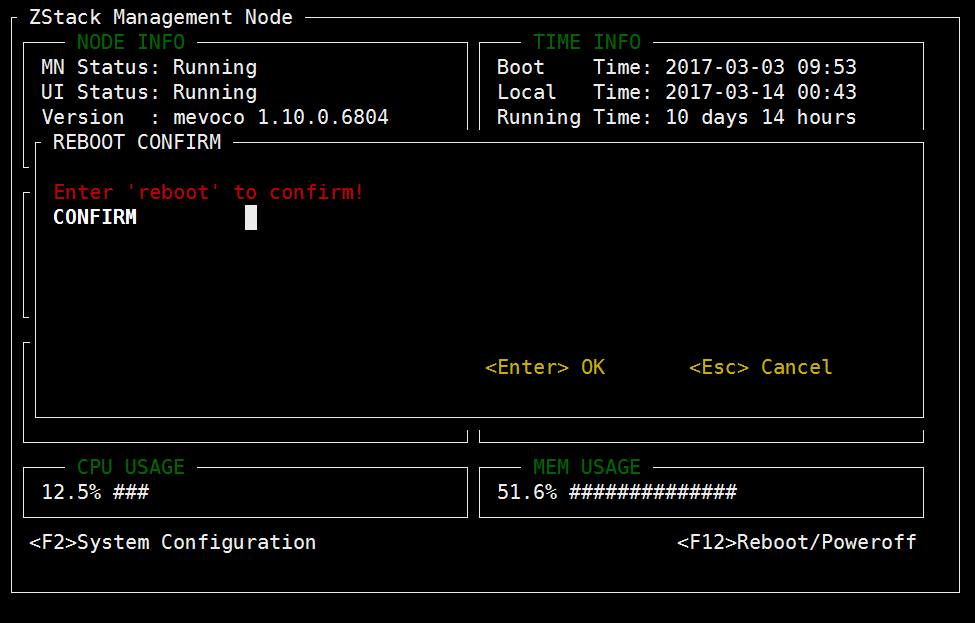
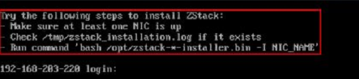

# 3.1 ZStack管理节点

如果用户选择管理节点安装模式，重启后会自动安装ZStack企业版安装包，如图3-1-1所示。安装完成后将自动进入TUI。

###### 图3-1-1 自动安装ZStack管理节点

### 1. 主界面

TUI的主界面如图3-1-2所示，主界面实时显示物理机的主要信息：

* `NODE INFO` 显示管理节点当前状态，包括服务是否运行、UI是否运行、ZStack版本以及UI地址等；
* `TIME INFO` 显示当前时间、服务器启动时间、服务器运行时长、服务器平均负载等；
* `DISK INFO` 显示ZStack默认安装目录以及日志目录等的剩余磁盘空间；
* `NIC INFO` 显示管理节点所有物理网卡的信息，其中`DOWN`表示网卡关闭、'UP'表示网卡启动、**'MN'表示该网卡为管理网卡**；
* `HOST INFO` 显示当前ZStack集群共有多少台计算节点，其中`Enabled`和`Connected`的各有多少；
* `VM INFO` 显示当前ZStack集群共有多少台云主机，其中`Running`和`Stopped`的各有多少；
* `CPU USAGE`和`MEM USAGE`分别显示该管理节点的实时资源利用率。

###### 图3-1-2 TUI界面

主界面还提供了`进入系统配置`和`重启/关机`两个入口。根据提示按下`F2`或者`F12`即可进入相应窗口。

### 2. 系统密码

在主界面按下`F2`或者`F12`时，需要首先输入系统密码，因为无论系统配置还是重启/关机都属于特权操作。下图中显示了输入系统密码的窗口，**根据提示输入ROOT密码，回车即可**。

###### 图3-1-3 输入密码

若密码不正确，操作会被阻止，TUI返回主界面。  

###### 图3-1-4 输入密码错误

**备注：任何时候，只要按下ESC键，就可以退出当前窗口，返回系统配置界面。**

## 3. 系统配置

如图3-1-5所示，系统设置的功能包括：修改密码、测试网络、配置网络、配置管理网络、配置控制台代理、收集日志、备份数据库、启动/关闭/重启ZStack服务、重装ZStack服务、重装ZStack服务并删除数据库、终端信息等。

###### 图3-1-5 系统配置

如上图所示，系统配置界面提供若干系统配置入口。**使用上下键移动光标，选择需要的配置按钮，按下回车即可进入相应配置界面**。对于熟悉Vim的用户，也可以使用`j`和`k`实现光标上下移动。

根据提示，按下`F2`可以退出至主界面。再次回到系统配置界面时需要重新输入ROOT密码。

### 修改密码

将光标移动至`Change Passwords`处，按下回车，即可进入密码配置窗口。该配置项集中了管理节点需要的四种密码修改动作：

* 修改系统密码
* 修改root账号的MySQL密码
* 修改zstack账号的MySQL密码
* 修改RabbitMQ密码

##### 修改系统密码

###### 图3-1-6 修改系统密码

根据提示输入旧系统密码、新系统密码以及新密码确认，回车即可。如果旧系统密码不正确、或者密码确认不一致，都会弹出错误窗口。

###### 图3-1-7 确认界面

用户需要根据提示，输入'Y'以确认。

##### 修改MySQL密码 

###### 图3-1-8 修改MySQL密码

修改MySQL密码需要MySQL的root权限，因此**首先需要输入MySQL root密码**， 然后根据提示再输入新密码和密码确认，回车即可。如果MySQL root密码不正确、或者密码确认不一致，都会弹出错误窗口。

此操作需要重启ZStack服务，耗时较长，需要用户按`Y`键确认。

##### 修改RabbitMQ密码

###### 图3-1-9 修改RabbitMQ密码

修改RabbitMQ密码需要管理员权限，因此**首先需要输入系统root密码**，然后**根据提示再输入新密码和密码确认，回车即可。** 如果系统密码不正确、或者密码确认不一致，都会弹出错误窗口。

此操作需要重启ZStack服务，耗时较长，需要用户按`Y`键确认。

### 重命名网卡

MN和HOST都增加了“Rename NIC”的按钮，因为MN可能添加自身为HOST，所有待添加的HOST都必须网卡名归一化。该操作需要用户输入旧网卡名和新网卡名。其中：

新网卡名必须满足：

* 不能为空； 
* 不能形如ethx； 
* 不能是系统系统中已存在的网卡名； 
* 不能以‘br\_’开头。

旧网卡名必须满足：

* 不能为空； 
* 必须是系统中已存在的网卡名； 
* 不能是桥接网卡名； 
* 不能有对应的桥接网卡

输入完成后，按下回车，此操作需要用户按`Y`键确认。

### 测试网络

###### 图3-1-11 测试网络

将光标移动至`Test Network`处，按下回车，即可进入网络测试窗口。这里默认填写了`114.114.114.114`，用户测试外网连接；若要测试内网连接，请自行填写内网IP。

### 配置网络

###### 图3-1-12 配置网络

将光标移动至`Configure Networks`处，按下回车，即可进入网络配置窗口。**这里罗列了管理节点中的所有处于启动状态并且分配有IP地址的物理网卡**，将光标移动至目标网卡上，再次回车，即可进入该网卡的配置界面。

**注：如果所选网卡名称后带有"\(MN\)"的标记，则意味着修改管理网络配置，需要较长的等待时间，且失败的可能性也较大，请谨慎操作！**

###### 图3-1-13 填写信息

所选网卡的已有配置会默认显示在输入框中（网关除外），用户可根据实际情况修改。如果出现以下任何一种情况，均认为输入有误：

* 有某个或某些输入项为空；
* 有某个或某些输入项不是合法的IP地址；
* IP地址和网关不在掩码所确定的同一个子网内；

###### 图3-1-14 确认界面

### 配置管理网络

某些情况下可能导致管理网卡的失效，需要重新配置。将光标移动至`Set Management Network`处，按下回车，即可进入配置管理IP窗口。  
**注：配置管理网络耗时较长，且失败可能性较大，请谨慎操作！**  

###### 图3-1-15 配置控制网络

### 配置终端代理\(Console Proxy\)

###### 图3-1-16 配置终端代理

将光标移动至`Configure Console Proxy`处，按下回车，即可进入终端代理配置窗口。 输入代理IP和代理端口，回车即可。  
控制台代理的原值将被读出并填充在输入项内，用户可按实际需要进行修改。如果出现以下任何一种情况，均认为输入有误：

* 代理地址和端口均为空；
* 代理地址不是合法的IP地址；
* 端口号不是1024至65535之间的数字。

此操作需要重置RabbitMQ服务，耗时较长，需要用户按`Y`键确认。

### 收集日志

###### 图3-1-17 收集日志

将光标移动至`Collect Logs`处，按下回车，即可进入日志收集窗口。点击回车即可将整个集群（包括管理节点和计算节点）的日志收集，并置于HTTP服务中。

###### 图3-1-18 日志导出成功

###### 图3-1-19 下载日志

###### 图3-1-20 在线浏览日志

根据提示，用户可以通过浏览器直接访问所有日志内容。

### 备份数据库

###### 图3-1-21 备份数据库

###### 图3-1-22 备份数据库成功

将光标移动至`Backup  Database`处，按下回车，即可进入数据库备份窗口。回车即可导出数据库至HTTP服务器中，以供下载。

### 启动/关闭/重启ZStack服务

###### 图3-1-23 启动/关闭/重启ZStack服务

将光标移动至`Start/Stop/Restart ZStack Servicec`处，按下回车，即可进入启动/关闭/重启ZStack服务窗口。回车后，再次移动光标，选择具体操作并回车。根据提示，输入`start zstack`以确认启动ZStack、输入`stop zstack`以确认停止ZStack、输入`restart zstack`以重启ZStack：  

###### 图3-1-23-1 启动Stack服务

###### 图3-1-23-2 关闭ZStack服务

###### 图3-1-23-3 重启ZStack服务

### 重装ZStack

###### 图3-1-24 重装ZStack

将光标移动至`Reset ZStack Service`处，按下回车，即可进入重装ZStack窗口。**该操作属于极重操作**，需要用户输入`reset zstack`，才能回车确认。

### 重装ZStack并清空数据库

###### 图3-1-25 重装ZStack并清空数据库

将光标移动至`Reset ZStack Service & Drop Database`处，按下回车，即可进入重置ZStack和数据库窗口。该操作与上一操作一样属于极重操作，而且在重装ZStack的同时还会清空已有的数据库，需要用户输入`reset zstack drop database`，才能回车确认。！**请谨慎使用此功能！**

### 进入终端

###### 图3-1-26 进入终端提示

ZStack TUI为用户保留了进入终端的入口。将光标移动至`Terminal Info`处，回车即可看到入口信息。其中：

* 按下`Ctrl + Alt + F2`可以进入保留终端，用户可以在里面执行常规命令 ，但是请谨慎使用，以免对系统造成破坏，影响ZStack服务运行。
* 按下`Ctrl + Alt + F3`可以进入`zstack-cli`命令行界面。
* 任何时候都可以通过按下`Ctrl + Alt + F1`返回ZStack TUI。

## 4. 重启/关机

###### 图3-1-27 重启/关机

在主界面按下`F12`即可进入重启/关机界面。用户选择将光标移动至`Reboot`或`Poweroff`按钮，回车即可进入确认界面。

###### 图3-1-28 重启确认

###### 图3-1-29 关机确认

两种操作都需要用户根据提示输入`REBOOT`或`POWEROFF`才可以回车确认，以免误操作。

此外，在“安装管理节点”模式下，如果由于缺少网卡配置或者其他原因导致导致ZStack安装失败，都会退出到终端。用户根据红框中的文字提示，手动安装ZStack并启动ZStack服务后，TUI会自动启动。  
手动安装ZStack的过程详见[升级ZStack](/install/upgrade.md)

###### 图3-1-30 网卡异常提示


