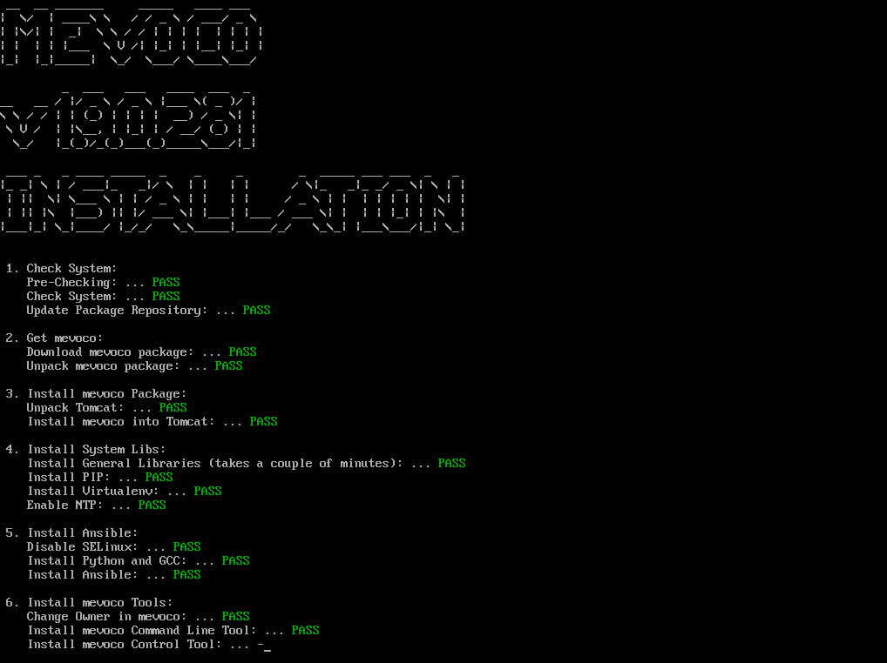
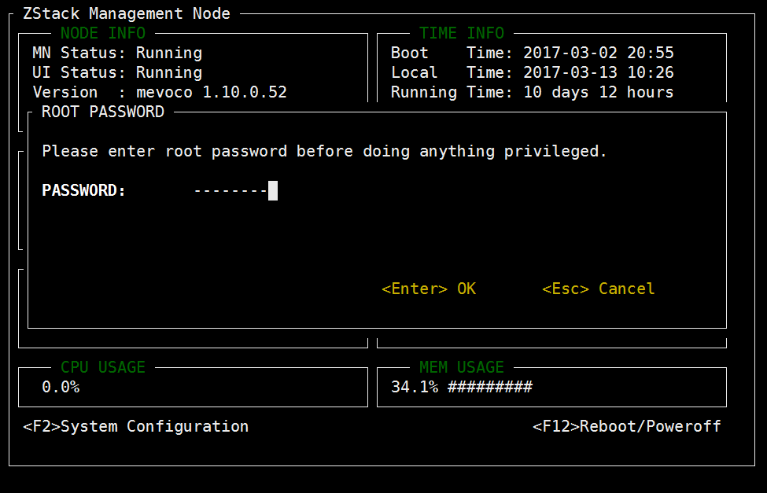
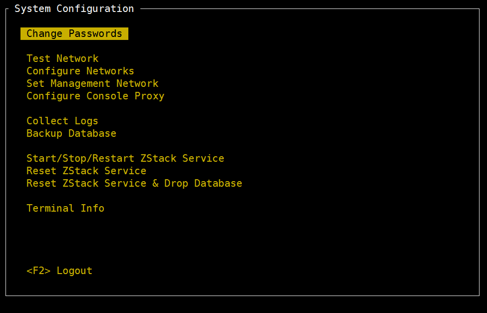
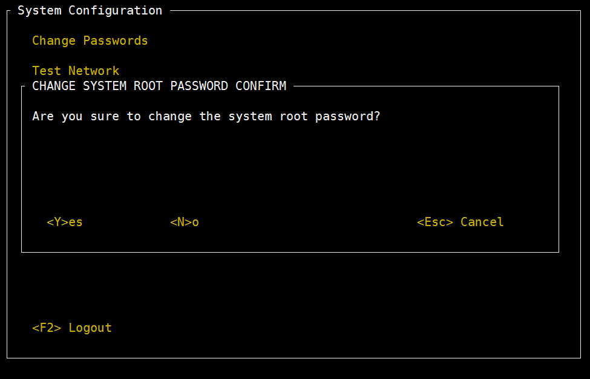
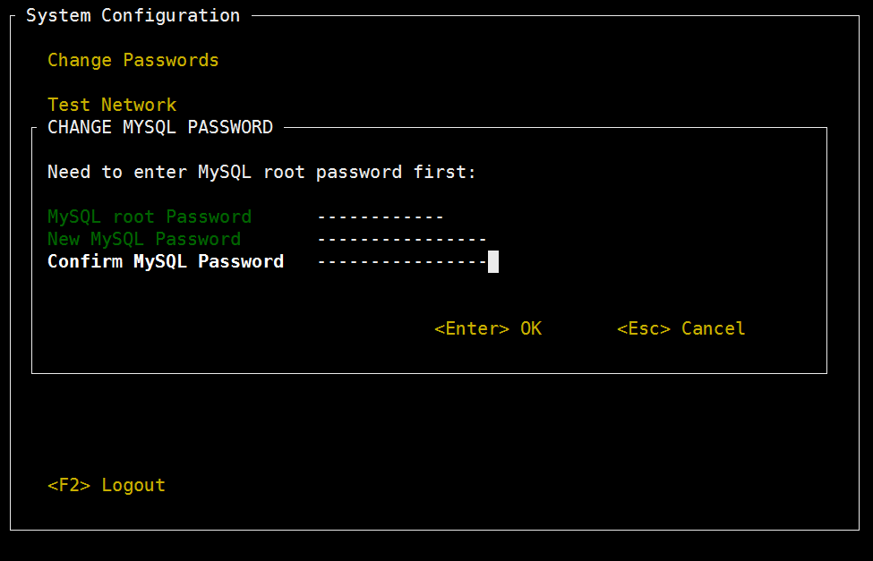
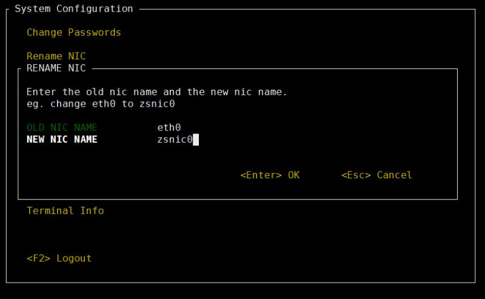
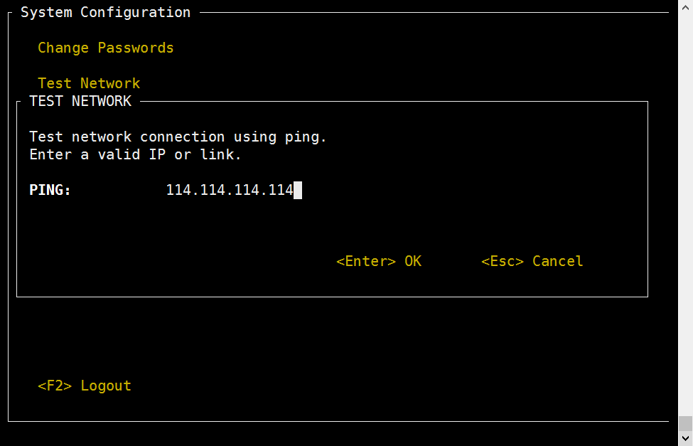

# 3.1 ZStack管理节点

如果用户选择管理节点安装模式，重启后会自动安装ZStack企业版的管理节点，如图3-1-1所示。安装完成后将自动进入TUI。

###### 图3-1-1 自动安装ZStack管理节点

#### 1. 主界面
TUI的主界面如图3-1-2所示，主界面实时显示物理机的主要信息：

- `NODE INFO` 显示管理节点当前状态，包括服务是否允许、UI是否允许、ZStack版本以及UI地址等；
- `TIME INFO` 显示当前时间、服务器启动时间、服务器运行时长、服务器平均负载等；
- `CPU USAGE` 显示每个CPU核心的实时利用率；
- `MEM/DISK FREE SPACE` 显示内存、SWAP、和磁盘的剩余空间；
- `NET TRAFFIC` 显示服务器网卡列表，及其对应的IP地址等信息。

###### 图3-1-2 TUI界面

主界面还提供了`进入系统配置`和`重启/关机`两个入口。根据提示按下`F2`或者`F12`即可进入相应窗口。

#### 2. 系统密码

在主界面按下`F2`或者`F12`时，需要首先输入系统密码，因为无论系统配置还是重启/关机都属于特权操作。上图中显示了输入系统密码的窗口，**根据提示输入ROOT密码，回车即可**。

###### 图3-1-3 输入密码

若密码不正确，操作会被阻止，TUI返回主界面。

###### 图3-1-4 输入密码错误

#### 3. 系统配置

如图3-1-4所示，系统设置的功能包括：修改Hostname、修改密码、测试网络、重启网络、配置网络、配置控制台代理、收集日志、备份数据库、重启ZStack服务、重置ZStack服务、重置ZStack服务和数据库、终端信息等。

###### 图3-1-5 系统配置

如上图所示，系统配置界面提供若干系统配置入口。**使用上下键移动光标，选择需要的配置按钮，按下回车即可进入相应配置界面**。对于熟悉Vim的用户，也可以使用`j`和`k`实现光标上下移动。

根据提示，按下`F2`可以退出至主界面。再次回到系统配置界面时需要重新输入ROOT密码。

 * **修改HOSTNAME**
 
ZStack服务使用RabbitMQ作为消息总线，而RabbitMQ是基于主机名的，因此服务器主机名的配置非常重要。

###### 图3-1-6 修改hostname

将光标移动至`Change Hostname`处，按下回车，即可进入主机名配置窗口。根据提示输入想要修改的主机名，再次按下回车即可。

**注意：** 主机名的选取需要遵循一定的规则，比如不可以是纯数字、不可以是`localhost`、不可以是IP地址等。

###### 图3-1-7 确认修改

由于修改主机名会导致ZStack服务重启，属于较重操作，因此不允许用户通过简单地回车，而是要显式地输入`Y`来加以确认，以免误操作。

###### 图3-1-8 等待界面

对于耗时较长的操作，TUI会给出`Please wait...`的提示，用户需耐心等待。.

###### 图3-1-9 hostname修改成功

当修改成功时会给出提示。

**备注1：之后的配置项大多包含类似的窗口，不会一一赘述。**

**备注2：任何时候，只要按下ESC键，就可以退出当前窗口，返回系统配置界面或者主界面。**

* **修改密码**
将光标移动至`Change Passwords`处，按下回车，即可进入密码配置窗口。该配置项集中了管理节点需要的四种密码修改动作：
- 修改系统密码
- 修改root账号的MySQL密码
- 修改zstack账号的MySQL密码
- 修改RabbitMQ密码

* **修改系统密码**

###### 图3-1-10 修改密码

根据提示输入旧系统密码、新系统密码以及新密码确认，回车即可。如果旧系统密码不正确、或者密码确认不一致，都会弹出错误窗口。

###### 图3-1-11 等待界面

当系统密码修改成功时，会自动退出系统配置界面，返回主界面。用户需要重新输入密码才可以再次进入系统配置界面。

###### 3.2.2 修改MySQL密码

修改MySQL密码需要MySQL的root权限，因此**首先需要输入MySQL root密码**， 然后根据提示再输入新密码和密码确认，回车即可。如果MySQL root密码不正确、或者密码确认不一致，都会弹出错误窗口。

此操作需要重启ZStack服务，耗时较长，需要用户按`Y`键确认。

###### 3.2.3 修改RabbitMQ密码

修改RabbitMQ密码需要管理员权限，因此**首先需要输入系统root密码**，然后**根据提示再输入新密码和密码确认，回车即可。** 如果系统密码不正确、或者密码确认不一致，都会弹出错误窗口。

此操作需要重启ZStack服务，耗时较长，需要用户按`Y`键确认。

##### 3.3 测试网络

将光标移动至`Test Network`处，按下回车，即可进入网络测试窗口。这里默认填写了`114.114.114.114`，用户测试外网连接；若要测试内网连接，请自行填写内网IP。

##### 3.4 重启网络

将光标移动至`Restart Network`处，按下回车，即可进入重启网络窗口。 重启网络操作需要用户按`Y`确认。

##### 3.5 配置网络

将光标移动至`Configure Networks`处，按下回车，即可进入网络配置窗口。这里罗列了服务器中的网卡，将光标移动至目标网卡上，再次回车，即可进入该网卡的配置界面。

根据提示填写IP地址、子网掩码和网关，回车。

如果所选网卡为管理网所在网卡，则需要谨慎操作。这会耗费较长一段时间，而且UI地址等都将发生变化。当修改成功过后，按`F2`退至主界面，会看到UI地址已经发生了变化。
如果所选网卡为普通网卡，则仅执行常规的网卡配置操作。

##### 3.6 配置终端代理(Console Proxy)

将光标移动至`Configure Console Proxy`处，按下回车，即可进入终端代理配置窗口。 输入代理IP和代理端口，回车即可。

此操作需要重置RabbitMQ服务，耗时较长，需要用户按`Y`键确认。

##### 3.7 收集日志

将光标移动至`Collect Logs`处，按下回车，即可进入日志收集窗口。点击回车即可将整个集群（包括管理节点和计算节点）的日志收集，并置于HTTP服务中。

根据提示，用户可以通过浏览器直接访问所有日志内容。

##### 3.8 备份数据库

将光标移动至`Backup  Database`处，按下回车，即可进入数据库备份窗口。点击回车即可将数据库打包并保存在`/var/lib/zstack/`目录下。

##### 3.9 重启ZStack服务

将光标移动至`Restart ZStack Service`处，按下回车，即可进入重启服务窗口。再次回车即可重启ZStack服务。 该操作耗时较长，需要用户输入`Y`确认。

##### 3.10 重装ZStack

将光标移动至`Reset ZStack Service`处，按下回车，即可进入重装ZStack窗口。**该操作属于极重操作**，需要用户输入`RESET`，才能回车确认。

##### 3.11 重装ZStack并清空数据库

将光标移动至`Reset ZStack Service & Database`处，按下回车，即可进入重置ZStack和数据库窗口。该操作与上一操作一样属于极重操作，而且在重装ZStack的同时还会清空已有的数据库！**请谨慎使用此功能！**

##### 3.12 进入终端

ZStack TUI为用户保留了进入终端的入口。将光标移动至`Terminal Info`处，回车即可看到入口信息。其中：
- 按下`Ctrl + Alt + F11`可以进入保留终端，用户可以在里面执行常规命令 ，但是请谨慎使用，以免对系统造成破坏，影响ZStack服务运行。
- 按下`Ctrl + Alt + F12`可以进入`zstack-cli`命令行界面。
- 任何时候都可以通过按下`Ctrl + Alt + F1`返回ZStack TUI。

#### 4. 重启/关机

在主界面按下`F12`即可进入重启/关机界面。用户选择将光标移动至`Reboot`或`Poweroff`按钮，回车即可进入确认界面。

两种操作都需要用户根据提示输入`REBOOT`或`POWEROFF`才可以回车确认，以免误操作。

### 三、关于计算节点TUI

计算节点在功能上可视为管理节点的子集，因此计算节点TUI基本上就是精简版的管理节点TUI，这里不再赘述。

###### 图3-1-4 自动安装ZStack管理节点

