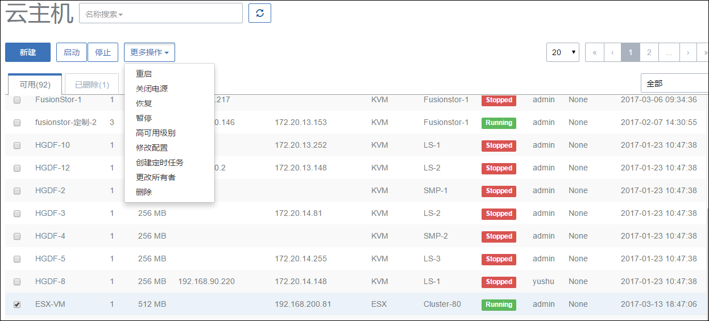
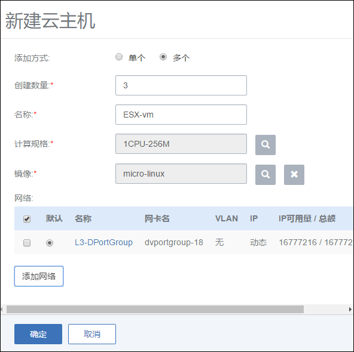

# 10.2 ESX(i)云主机操作

添加vCetner成功后，在云主机界面，会自动显示ESX(i)云主机的信息。如图10-2-1所示

###### 图10-2-1 云主机界面

用户可以点击“新建”按钮，新建所需的ESX(i)云主机。这个操作与[7.1新建云主机](/VM/new-vm.md)一样，需要填写云主机名字、选择镜像、计算规格、网络，并支持批量创建。如图10-2-2所示.
* 注意： 镜像和网络为vCenter中已创建的资源，未来会支持创建云主机的更多高级设置。

###### 图10-2-2 新建云主机界面

在云主机列表界面,点击相应云主机的行,可以展开云主机的详细信息并对云主机进行相应的操作,如图10-2-3所示。

根据虚拟当前状态的不同,ESX(i)云主机的操作可支持启动、停止、重启、关闭电源、打开控制台、设置控制台密码、更改所有者、删除等操作。

###### 图10-2-3 新建云主机界面

对ESX(i)云主机操作的定义与kvm云主机相同，具体如下：

1.启动:将处于停止状态的云主机启动起来,进入云主机系统;

2.停止:将处于运行状态的云主机停止掉,使云主机系统关机;

3.重启:将处于运行状态的云主机重启,使云主机系统重新启动;

4.关闭电源：当云主机处于运行状态时，使云主机强制进入停止状态。在云主机详情页面，点击操作列表中的关闭电源。正常状态下不建议执行此操作；

5.打开控制台：将进入云主机系统的控制界面,可以登录控制云主机;

6.设置控制台密码：
用户可以添加\/删除云主机控制台密码，该密码为VNC协议的密码，而不是云主机本身的密码。设置完成后，重启云主机生效。

* 添加控制台密码

###### 图10-2-4 添加控制台密码界面

* 删除控制台密码

###### 图10-2-5 删除控制台密码界面