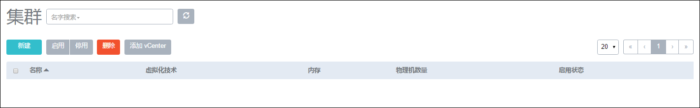
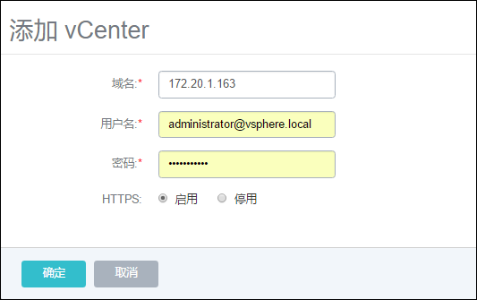
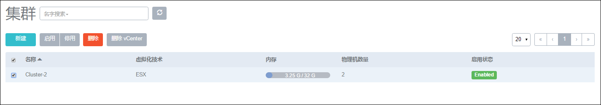
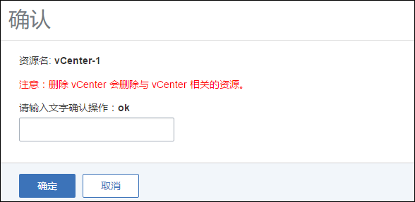

# 10 vCenter操作

1. 添加vCenter

点击集群界面的添加VCenter按钮，进入添加vCenter界面。如图10-1-1所示。

* 目前只允许用户添加一个vCenter

###### 图10-1-1 未添加vCenter集群界面

###### 图10-1-2 添加vCenter界面

2.删除vCenter

当用户添加成功一个vCenter后，集群界面中“添加vCenter”按钮变为“删除vCenter”按钮。

###### 图10-1-3 已添加vCenter集群界面

###### 图10-1-4 删除vCenter界面
